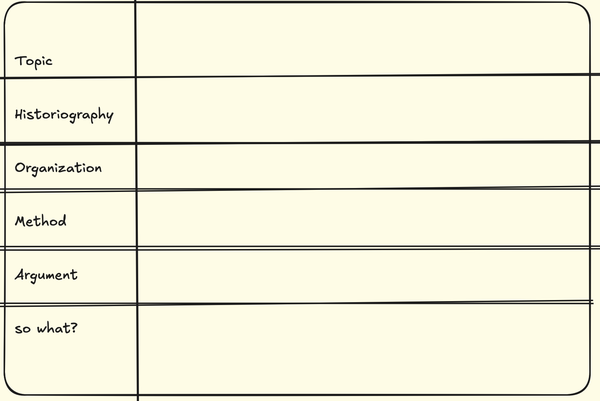

## Reading Historical Scholarship¶

Reading historical scholarship is not just about understanding the content, but also figuring out how the thing you're reading is part of a broader dialogue. Allow me to introduce [a useful approach to reading such material by Danna Agmon called 'THOMAS'](https://drive.google.com/file/d/1hunJKCBwzELxmZJb2oaM1W5aGqorasZQ/view). I quote Agmon directly below:

THOMAS: A Useful Mnemonic for Reading Historical Scholarship

When reading works of historical scholarship, the following mnemonic is a helpful tool to keep in mind as you prepare for class. All the questions are key for understanding the book, but they are arranged in ascending order of importance, from least to most important.

+ **Topic**: The basic questions: When? Where? What is this book/article about?
+ **Historiography**: What are the multiple scholarly conversations in which this work participates? What does it add to these conversations?
+ **Organization**: what is the central organizing structure of this work? Chronological? Thematic? Geographic? Are there any narrative devices put to use? How does the organization advance the argument?
+ **Method**: What sources are used in this book? How is this evidence analyzed? Is there an overarching theoretical or conceptual approach? How does the theory intersect with the evidence?
+ **Argument**: What is this author’s original thesis? What new thing does it explain?
+ **So what?** This could be rephrased as "significance" or "stakes."" What is important or useful about this book, beyond the confines of the topic? Put differently, why would non-specialists in the field care to read this book?

If you were writing a research method using the THOMAS mnemonic, just write the headings down the left hand side of the page, then scribble out some boxes:

Write the 'citation key' for whatever you're reading across the top, and a short version of the title, eg `Graham2006 Networks & Roman Itineraries & ABM`. A 'citation key' is a short code that you use to refer to scholarly works without having to go through the full bother of writing out the bibliography. [Zotero](zotero) and other reference managers use these to provide a unique identifier to a scholarly work.

Then, proceed to fill in the grid. You don't have to use the grid, of course; a series of headings works just as well. Point-form is fine **HOWEVER** you have to provide enough detail so that Future You who returns to these notes a week, a month, a term later has some idea of what you are talking about. Similarly, if/when I ask you to do one of these in class from memory, you've got to provide enough so that I understand what you're talking about.

