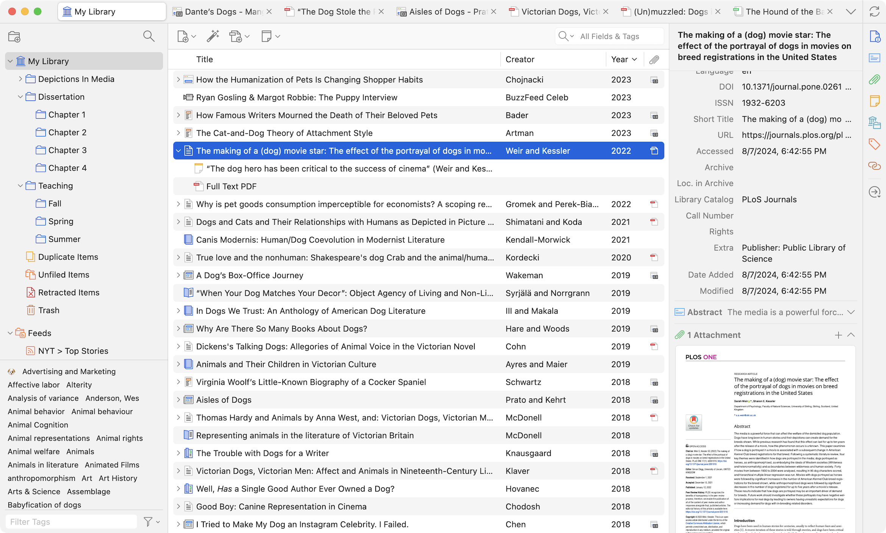

This is a first year class. Most of you are in first year: Zotero will save many hours of grief and frustration.

Zotero is software for citation management and for making notes on what your read and annotations on pdfs. **If all you ever do is use it to keep track of the metadata - author, title, publisher, etc - for what you read in university** then you will be further ahead than many of your peers. I am not going to police your usage of Zotero (or require some kind of assessment piece on using it) but I **strongly** recommend you take the time to learn how to use it.

You can download and install Zotero from [https://www.zotero.org/](https://www.zotero.org/).

Then, if [you make an account with Zotero as well](https://www.zotero.org/user/register) you can take advantage of some free storage space that allows you to sync your notes and library across multiple devices.

So how do you use it? Our friends at the University of Ottawa [have a very helpful video](https://uottawa.libguides.com/how_to_use_zotero/introduction); MacOdrum Library provides [this walk-through pdf](https://library.carleton.ca/sites/default/files/2024-02/Zotero%20Guide.pdf).

How do _I_ use it? If I'm looking up articles on (eg) [JSTOR](https://jstor.org) and I have Zotero installed (along with its plugins for my web browser), I can just click a button in my browser to get Zotero to harvest all of the metadata (including, often, the full article pdf!) for the article I'm reading. 

When I come to _write_ something, and I want to create my bibliography, I can set Zotero to MLA style (or Harvard, or whatever) and then drag-and-drop the reference into Word; because I'm dragging from Zotero, the citation will be fully formatted in the proper style.

That's an absolute minimum use case. If that's all you ever did with Zotero, that would still put you ahead of most of your peers. If you want to know or explore what else you could do, why don't you arrange a conversation with Dr Graham or your TAs?
