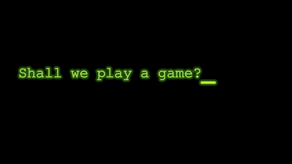

<!-- .slide: data-background="images/computer1_mid_60s.jpg" data-background-opacity="0.25" -->

> [https://hist1900a.netlify.app/](https://hist1900a.netlify.app/)

### HIST1900A
#### The History of the Internet
_with Professor Shawn M. Graham_
**shawn.graham@carleton.ca**

<small>PA406; sometimes PA435-437; oftentimes Library coffeeshop</small>

note:
check check check!

---

 

---

# Round 1

<ul>
<li class="fragment">Morphic Street, 9 o'clock tonight, password: swordfish.</li>
</ul>

note:
play the telephone game with the first row. give them that message. what does it become at the end of the row? One of the major problems in human civilization has always been the communication of information over distance, securely. How can we know that the message received is the one that was sent?

---

# Round 2

<ul>
<li class="fragment">hw mch dstrctn cn hppn t mssg bfr t s nrdbl</li>
</ul>

note:
language features redundancy. this will turn out to be a key element in the creation of digital communication

---

# Round 3.

+ message 1: we will meet downstairs by the upstairs stairs
+ message 2: when the clock clocks down we will wend our way willingly westward.

note:
give two messages to opposite corners of the front. ask them to pass the message to the person who they think can get the message to the person middle back row the fastest... and go!
The problem of bandwidth is the problem of what happens when two messages are competing in the same space.

---

These are silly games. But they point to some fundamental problems of communication that have profound consequences. 
  
This course will explore that history.

note:
The ‘history of the internet’ is more than the history of a particular package of technologies. It’s a story about power, people, culture, and materials. 

---

#### People Have Devised All Sorts of Networks

---

---

---

---

To understand all this we will dig our way backward, like archaeologists.

And like archaeologists, we find that meaning happens when we understand both chronological and spatial contexts and interfaces.

---

## Agenda

- [Who I am](https://shawngraham.github.io)
- Who Your TAs Are
- Who You Are And Why That Matters
- What We're After
- How It Works
- Logic Of Starting In The Present And Working Backwards
- Next Week

note:
what we're after: learning outcomes, why I'm not assigning essays but instead focusing on note-making. emergent structure? pkm-webnotes?
how it works: writing precis notes
logic: historians start at some arbitrary 'beginning' and tell the story forwards. archaeologists start at ground level: today, and work backwards. methods are more complicated than that for both, but for now, it's a useful lie that moves us forward

--

## Things I've Written

--

## Where I'm From

_photo cc Trevor Schwellnus_

---

## Your TAs!

- Keegan Rumig
- Fionnula Braun
- Rebecca Friend

_They are here to support you, and to help me, in this class._ 

They're very nice.

---

## Who You Are

note:
and why does this matter? It matters because it sets your expectations: what does an arts student expect in terms of assessment, content, approach? what does a computer science student expect? TPS: what are your expectations, as a class? I don't know where you're from, either, but if you're the first in your family to attend university, let me tell you the secret to unlocking the hidden curriculum: go hang out with your prof during their student hours. You don't have to have any agenda, either.

---

## What We're After & How It Works

+ also known as, [the syllabus](https://hist1900a.netlify.app)
+ GET A HILROY NOTEBOOK for the assessment pieces

note:
accommodations, talk to me!

---

## The Logic of Starting In The Present And Working Our Way Backwards

Anybody ever been on a dig?

---

## Next Week

+ Get Hypothesis sorted out
+ Get Zotero up and running
+ Explore/Read for Sept 8: 
	- Page through [Tim Berners-Lee’s own account of the start of the web](https://www.w3.org/2004/Talks/w3c10-HowItAllStarted/?n=0) (this is a slide show; the 'next' button is in the top right-hand corner) 
	- read [Bory’s The Myth of the World Wide Web](https://www-jstor-org.proxy.library.carleton.ca/stable/j.ctv12fw7sn.7?seq=3) and think about how Bory's vision contrasts with Berners-Lee's(the link goes to the JSTOR service via the University Library; you might need to be logged into the Library to access).