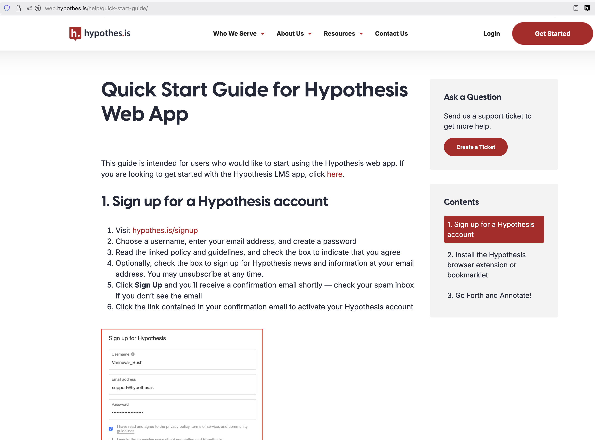
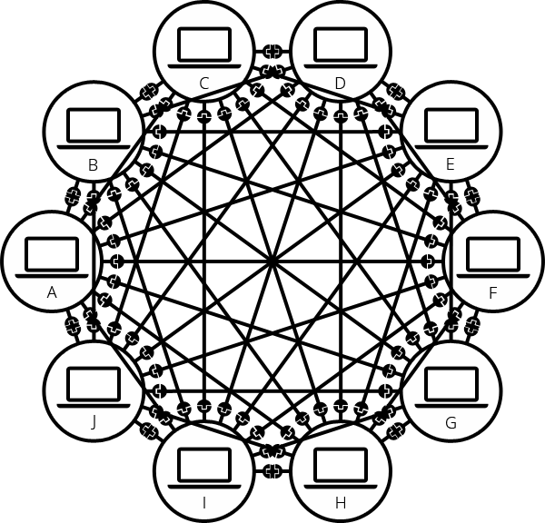

### Entrance Ticket

One big idea that challenges you, from Bory's piece?

note:
hand out index cards; direct them to write their names, too. TPS: explain idea & why it challenges; Discuss; big ideas on the board, photo. group ideas. unconference separate major thoughts. 

---

### Hypothes.is

[Go here](https://web.hypothes.is/help/quick-start-guide/)

---

[our reading group](https://hypothes.is/groups/eyW4RXMR/hist1900a-f25)

---

### What Makes A Good Annotation?

note:
- tps time! draw attention to precis/thomas again
- the value of private annotations too (for when you're irritated)
- annotations are not the same as discussion posts in an LMS

---

<!-- .slide: data-background="images/removing-topsoil.JPG" data-background-opacity="0.25" -->

    

### Clearing Away The Topsoil

What is the current state of the web / internet? What things will we need to peel back?

    <small><small>Background Image: Digminster Community Archaeology Project, 2013 [link](https://digminster.blogspot.com/2013/08/and-were-off.html)</small></small>

---

<!-- .slide: data-background="images/murder-wall.jpg" data-background-opacity="0.5" -->

### It's Not Pretty

        <small>...I might get carried away.</small>

---

### Web =/= Internet

**The Internet**: Physical infrastructure and protocols (TCP/IP, routers, cables, computers)

**The Web**: The application layer built on top of the internet

note:
draw something? https://excalidraw.com/

---

### The Original Vision vs. Reality

<small><small>"The original idea of the web was that it should be a collaborative space where you can communicate through sharing information." — Tim Berners-Lee </small></small>

note:
Tim Berners-Lee's Vision (1989)
- Decentralized information sharing
- Universal access to knowledge
- User empowerment and creativity
- Open standards and protocols
- built on existing technologies like hypertext. but an emaciated vision!
AND: the web as devised by TBL wasn't the only option! Other visions on_top of the internet existed!

---

It occurs to me that it might be useful to explain some of the physicality of the internet (handy info here if this is all new to you: [link](https://developer.mozilla.org/en-US/docs/Learn_web_development/Howto/Web_mechanics/How_does_the_Internet_work))

The following few images are pinched from Mozilla's helpful article.

---

note:
computer to computer: physically connected, functions as one big computer. A network of 2 computers

---

note:
but ten computers requires 9 cables for each computer pair, so 45 cables

---

note:
you invent a switch (another kind of computer), so you only need ten cables

---

note:
You could start connecting these independent networks together by linking switches together, but this leads to fragility and a bunch of other engineering problems

---

note:
like this

---

note:
you invent a router - another kind of computer - that connects to other routers by piggybacking ontop of an existing internetwork: the phone system! So we'll also have to talk about the history of the phone, which in turn, depended on the telegraph

---

note:
But how do you find the other networks? Your router connects to an ISP which handles the way-finding for you - they have super-routers connected to other super-routers. In the 1970s, an actual human being managed all of this.

Finding computers?  "IP address" (where IP stands for Internet Protocol). It's an address made of a series of four numbers separated by dots, for example: 192.0.2.172. to make things easier, we can alias an IP address with a human-readable name called a domain name. email & irc are also built on top of the internet

---

The internet exists in the physical world. Don't forget that.

note:
There's a reason why so many data centres have been built in this part of virginia, near dulles airport. We'll get to that too!

---

#### **Today's Reality**
- Centralized corporate control
- Surveillance-based business models
- User manipulation and addiction
- Proprietary platforms dominating open standards

Note: We've moved from a web designed for collaboration to one designed for extraction and control.

---

<!-- .slide: data-background="images/big-five.png" data-background-opacity="0.25" -->

### The Platform Oligopoly

note:
the big five, control most everything:
- **Google**: Search, ads, browsers, mobile OS
- **Meta**: Social networks, messaging, VR
- **Amazon**: E-commerce, cloud infrastructure, logistics
- **Apple**: Mobile ecosystem, app distribution
- **Microsoft**: Operating systems, cloud, productivity
...but keep an eye on OpenAI, Anthropic, NVidia etc...

---

#### **Market Concentration Statistics**
- Google: just under 90% of global search traffic (dipping below first time in years)
- Facebook/Meta: 3+ billion active users
- Amazon: 40% of US e-commerce
- Apple/Google: pretty much all of mobile OS market share

---

<!-- .slide: data-background="images/odalv-mrl0e0IiBao-unsplash.jpg" data-background-opacity="0.25" -->

#### Surveillance Capitalism

      <small><small>Background photo via unsplash.com user Odalv
</small></small>

note:
Data Extraction Economy
- Behavioral surplus harvesting
- Predictive products sold to third parties
- Personalization as manipulation
- Privacy as luxury commodity

Real-world Impacts
- Political manipulation (Cambridge Analytica, X)
- Mental health crises
- Echo chambers and polarization

---

<!-- .slide: data-background="images/miikka-luotio-xEKGClbBj6s-unsplash.jpg" data-background-opacity="0.25" -->

#### The Attention Economy

      <small><small>Background photo via unsplash.com user Miikka Luotio </small></small>

note:
Persuasive Design Tactics
- Infinite scroll mechanisms
- Variable ratio reinforcement Tiktok for instance & how things get on FYI-> drives creators
- Fear of missing out (FOMO)
- Notification dependency

Consequences
- Average screen time: 7+ hours daily
- Shortened attention spans
- Dopamine dysregulation
- Social comparison culture

---

<!-- .slide: data-background="images/rodrigo-araya-JyrTzPLSLto-unsplash.jpg" data-background-opacity="0.50" -->

#### Digital Divides

      <small><small>Background photo via unsplash.com user Rodrigo Araya</small></small>

note:
Access Disparities
- 2.9 billion people still offline
- Rural vs. urban connectivity gaps
- Economic barriers to high-speed internet
- Device and digital literacy divides

Amplified Inequalities
- Educational disadvantages
- Economic opportunities lost
- Healthcare access limited
- Democratic participation hindered 

---

#### The Creator Economy Illusion

      <small><small>Background photo via unsplash.com user s.o.c.i.a.l.c.u.t.</small></small>

note:
Platform Dependency
- Algorithm changes destroy livelihoods overnight
- Race to the bottom pricing
- Unpaid emotional labor
- Content moderation inconsistencies
- Porn

False Promises
- "Anyone can be successful"
- Survivor bias in success stories
- Exploitation of creative labor
- Monetization of personal relationships

---

      <small><small>Background photo via unsplash.com user ev</small></small>

note:
Platform Labor Extraction
- Uber, DoorDash, TaskRabbit precarity
- Algorithmic management
- No benefits or job security
- Race to the bottom wages

Invisible Digital Labor
- CAPTCHA solving
- Content moderation trauma
- Data annotation work
- Crowdsourced AI training

---

#### Algorithmic Governance: Code as Law

**Invisible Decision Making**
- Content visibility algorithms
- Recommendation systems bias
- Automated content moderation
- Credit scoring and life opportunities
- 'Age Verification' & Unintended Consequences

note:
Democratic Deficit
- No accountability or transparency
- Corporate decisions affecting public discourse
- Algorithmic discrimination
- Erosion of editorial responsibility
- big producers can put in ridiculous age verification; 3rd party software providers handling sensitive info; mergers, fails; wikipedia to be unaviable in UK! Everyone in UK learns how to VPN! Really bad stuff not affected; learning about lgbtq+ gets caught... Nerd Harder!

---

#### Truth in the Age of Algorithms

Also, a word [on bullshit](https://en.wikipedia.org/wiki/On_Bullshit).

note:
Epistemological Crisis
- Algorithmic amplification of misinformation
- Coordinated inauthentic behavior
- Deepfakes and synthetic media
- Collapse of shared reality

Weaponization of Platforms
- State-sponsored disinformation
- Commercial propaganda
- Astroturfing campaigns
- Polarization as engagement strategy

---

#### The Mental Health Crisis

note:

- Social media depression and anxiety
- Body dysmorphia from filtered reality
- Cyberbullying and harassment
- Digital self-harm communities
- AI and the pretense that there's a person who cares on the other side of the screen

Vulnerable Populations
- Teenagers and developing minds
- Marginalized communities
- People with existing mental health conditions
- Elderly users targeted by scams

---

#### Environmental Impact

note:
Energy Consumption Crisis
- Data centers consumed 1.5% of global electricity in 2024, set to double next year
- Cryptocurrency mining environmental damage
- Planned obsolescence of devices
- Cloud storage's physical footprint

**E-waste Problem**
- Millions of tons annually
- Toxic material disposal
- Global south dumping grounds
- Resource extraction for rare earth minerals

---

#### Privacy as Performance

note:
**Privacy Theater**
- Cookie banners without real choice
- Terms of service nobody reads
- "Privacy-focused" marketing
- Regulatory capture attempts

**Normalization of Surveillance**
- Smart home devices always listening
- Location tracking as default
- Biometric data collection
- Predictive policing systems

---

#### The Social Graph Trap

note:
**Social Capital Extraction**
- Relationships as data points
- Network effects lock-in
- Social credit systems
- Reputation economies

**Authentic Connection Loss**
- Performative social media presence
- Quantified relationships
- Fear of missing out vs. joy of missing out

---

## That's the web/internet today

Next day, let's peel back some layers to start figuring out _how we got to now_.