

## Straw Poll Time

If web =/= internet, why did we spend so much time on the current state of the web?

+ A: these are emergent features of the underlying structure of the thing called 'internet'
+ B: the current state has its roots across multiple technologies
+ C: technological features have social, economic, and cultural implications
+ D: yes to all of that 

note:
30 minutes for talk then precis time

---

### Everything is Awful

Everything's been... enshittified.

The last fifteen years or so have been particularly bad (and getting worse?)

---

"Here is how platforms die: first, they are good to their users; then they abuse their users to make things better for their business customers; finally, they abuse those business customers to claw back all the value for themselves. Then, they die."

**— [Cory Doctorow](https://pluralistic.net/), 2023**

---

### enshittification (noun)

A systematic process where digital platforms progressively degrade their service quality to extract maximum value.

note: 
Doctorow coined this term in 2023, https://www.wired.com/story/tiktok-platforms-cory-doctorow/ though the pattern has been observable for years across major platforms. Most people forget that last part though. Doctorow's concept gives us a framework for understanding platform decay and points toward structural solutions rather than just individual responses.

---

## The Three-Stage Process

### Stage 1: **User Acquisition**

note:
- Platforms prioritize user experience
- Services are free or cheap
- Focus on growth and engagement

---

### Stage 2: **Business Customer Focus**

note:
- Users become the product
- Advertisers and business partners prioritized
- User experience begins to degrade

---

### Stage 3: **Value Extraction**

note:
- Platform squeezes all parties
- Maximizes profit extraction
- Quality deteriorates rapidly

Each stage represents a fundamental shift in who the platform serves and how value flows through the system.

---

With regard to AI, what stage are we at?

note:
AI is a web technology that has profound implications for how the internet will work in the future (data centres, mining, centralization of power, control)

- signs of enshittification (https://pathocking.com/2025/01/06/handout-enshittification-cory-doctorow/):

- Too Many Ads: The service becomes overloaded with ads, making it difficult to use or enjoy.
- Paywalls and Hidden Costs: More features are locked behind paywalls, and users are forced to pay for things that were once free.
- Decreasing Quality: The service becomes slower, less reliable, or loses valuable features.
- Hyper-Monetization: The company introduces aggressive monetization tactics like microtransactions or fees for basic functions.

---

Enshittification was understood from the beginning - Page & Brin in 1998:

"Advertising funded search engines will be inherently biased towards the advertisers and away from the needs of consumers"

note:
- the greatest thing that the internet did was 'the end-to-end principle'. Doctorow: "the end-to-end principle: the idea that networks should be designed so that willing speakers' messages would be delivered to willing listeners' end-points as quickly and reliably as they could be. That is, irrespective of whether a network operator could make money by sending you the data it wanted to receive, its duty would be to provide you with the data you wanted to see."

- But advertising, and the walled gardens that emerged over the last twenty years, make it too easy to trap people in. Each platform starts by giving things away, and then they make it too hard to leave; then they give you away to business, and make it too hard for them to leave; then they just extract funds until the carcass dies.

---

## Why Does This Happen?

---

### Network Effect

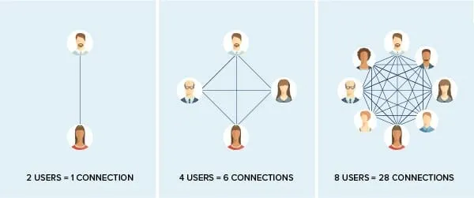

Or, there's a reason your parents are the only people you know who use Facebook still.

note:

- utility grows as more people join
- Users can't easily leave due to social connections: you can't take your graph with you!
- "Everyone else is here" mentality
- This is called High switching costs

---

### **Switching Costs**

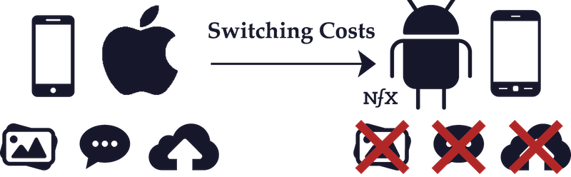

note:
- Data lock-in (photos, messages, connections)
- Learning new interfaces
- Loss of digital identity/history

---

### **Market Consolidation**

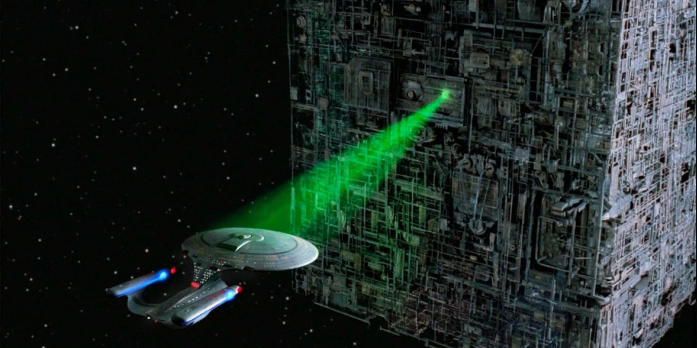

note:
- Few viable alternatives
- Acquisition of competitors
- Regulatory capture

These factors create a "walled garden" where users become trapped, allowing platforms to gradually extract more value.

---

## Classic Example: Facebook's Evolution

(btw: [Doctorow again](https://pluralistic.net/2023/08/27/an-audacious-plan-to-halt-the-internets-enshittification-and-throw-it-into-reverse/))

note:
https://pluralistic.net/2023/08/27/an-audacious-plan-to-halt-the-internets-enshittification-and-throw-it-into-reverse/

---

### **2004-2013: User Paradise**

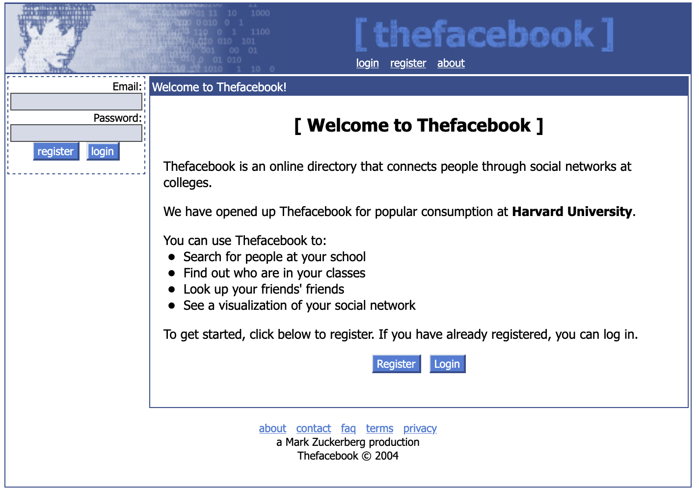

note:

- Clean, chronological timeline
- No ads, organic reach
- Privacy-focused messaging
- you saw the posts of the people & communities that you followed

---

### **2013-2019: Advertiser Heaven**

I don't have a good image for this. That in itself is interesting.

note:
- facebook allows advertisements to appear in feeds, based on user's social graph & demonstrated interests: both what you clicked on in facebook, and outside of facebook (tracking of various kinds, with more sophistication over the years)
- advertisers paid to get their materials in front of users' eyeballs. Users can't opt out
- initially, a business could also post their own materials to their own fb page, and have those posts promoted as a kind of advertising; so a business could use it as a gateway to their own materials, a link
- feed becomes less and less the people you follow, and more and more the 
- facebook tells advertisers, 'videos are getting billions of view'
- 'Pivot to video' - which meant more advertising dollars spent than on text. critic John Herrman : "What the shift to Facebook video means is that Facebook is more interested in hosting the things media companies make than just spreading them, that it views links to outside pages as a problem to be solved, and that it sees Facebook-hosted video as an example of the solution."
- Algorithm-driven feeds
- Promoted posts and ads
- Data harvesting for targeting
- Facebook actually lied about how many views videos were getting
- You the advertiser had no real way of measuring the effectiveness of your ads: you had to trust facebook's advertiser tools

---

### **2020-Present: Value Extraction**

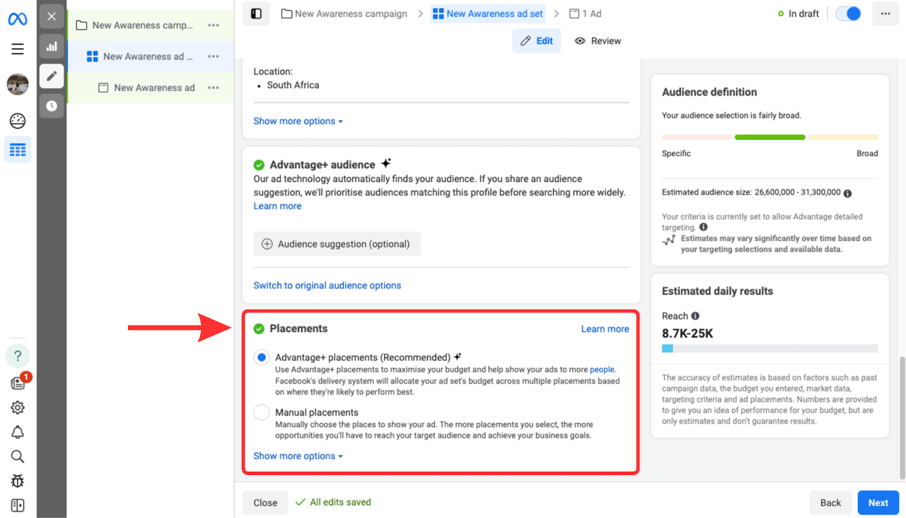

<small>This is more recent, but note how you have to pay extra for various placement options... the whole thing is riddled with gotchas</small>

note:
- Pay-to-reach your own audience
- Aggressive data collection
- Declining organic reach for creators

Facebook's transformation perfectly illustrates the three-stage enshittification process over nearly two decades.

- never even minding that Z's first site was created as a way of creeping on women students; 'FaceMash' - hot or not; zuckerberg invaded privacy, violated copyright, breach of security... but hey, let's prosecute aaron swartz, eh? (Z also tried to use early login data for thefacebook to breach the security of Harvard Crimson student reporters) ... So that's the kind of guy Z is.
- early FB showed you posts from friends and family; they join so they can see your posts; now you can't leave because swtiching costs are too high - you can't take your graph with you
- then it starts shoving posts into your feed from accounts you don't follow - started with media companies - sending lots of eyeballs to those companies
- then it chocked off the ability for media company to post an excerpt, had to post the full text
- now the readers don't go to the publications, - no ad or subscription revenue on their own site- so they're completely dependent on FB. Would not show articles to the readers who explicitly signed up to follow those publications unless they paid FB a ransom to boost their articles. Canadian digital services tax.
- it does the same thing to sellers. Comes to an illegal agreement with Google where FB would get an illegal advantage in advertising auctions in exchange for FB canning its own service.
- (oh, and by the way, fb has run unethical behavioural experiments to see if they can manipulate people's emotions. They can.)

---

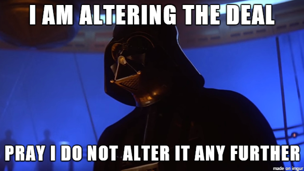

---

## The Amazon Marketplace Pattern

ie: the exact same progression

note:

### **Early Days (2000s)**

- Best prices for consumers
- Easy returns and shipping
- Focus on customer satisfaction

### **Growth Phase (2010s)**
- Sellers flocked to the platform
- Amazon optimized for seller fees
- Introduction of sponsored products
- Amazon, tried to buy diapers.com, got rejected, and then lit $100m on fire selling diapers below cost, until diapers.com went bankrupt.

### **Current State**
- Search results dominated by ads
- Counterfeit products proliferate
- Sellers squeezed by fees and competition

Amazon shows how enshittification affects e-commerce, with fake reviews and sponsored results making genuine product discovery increasingly difficult. Amazon says if you sell anywhere else, the price on amazon has to be the lowest

---

## The Decline of Google Search 

---

Google's big insight:

A page is important if other pages point to it.

That's it. That's the foundation of their wealth, their power.

note:
prior to this, everything depended on lists, directories, human curation

---

#### A Quick Detour to Network Theory

Who is the most important person in Game of Thrones?

+ data: [got-edges.csv](https://raw.githubusercontent.com/melaniewalsh/sample-social-network-datasets/refs/heads/master/sample-datasets/game-of-thrones/got-edges.csv)

+ network analysis website: [network navigator](https://networknavigator.jrladd.com/)

note:

- 107 different characters, and the edges csv contains 353 weighted relationships between those characters, which were calculated based on how many times two characters' names appeared within 15 words of one another in the novel. 

---

### **Google's Golden Age**

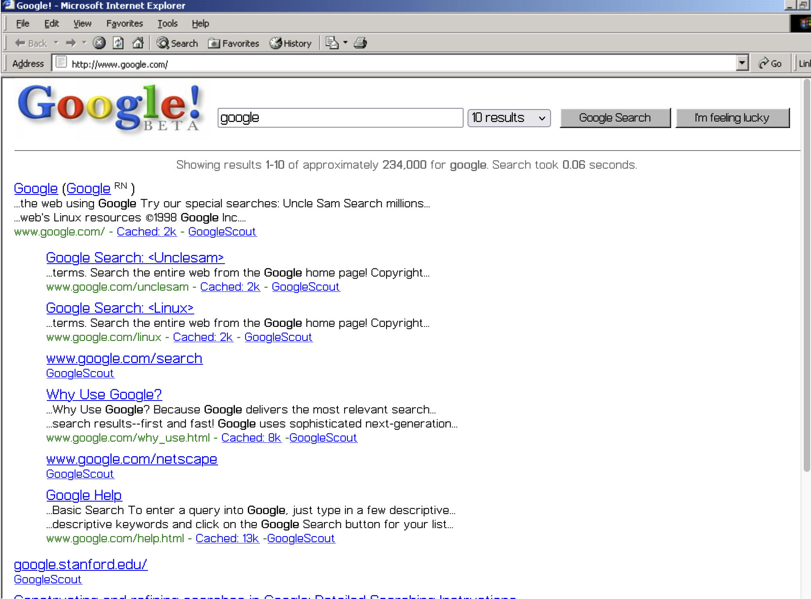

note:

- Relevant, useful results
- Minimal advertising
- Focus on information quality

---

### **The Ad Revolution**

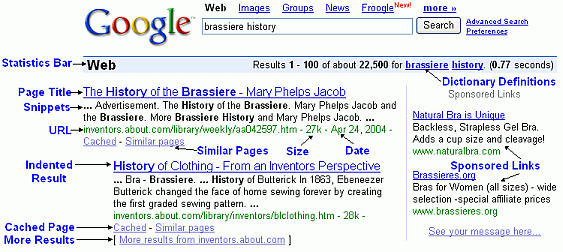

note:
starts around 2000; adwords

- Sponsored results at top
- SEO gaming becomes profitable
- Content farms proliferate

---

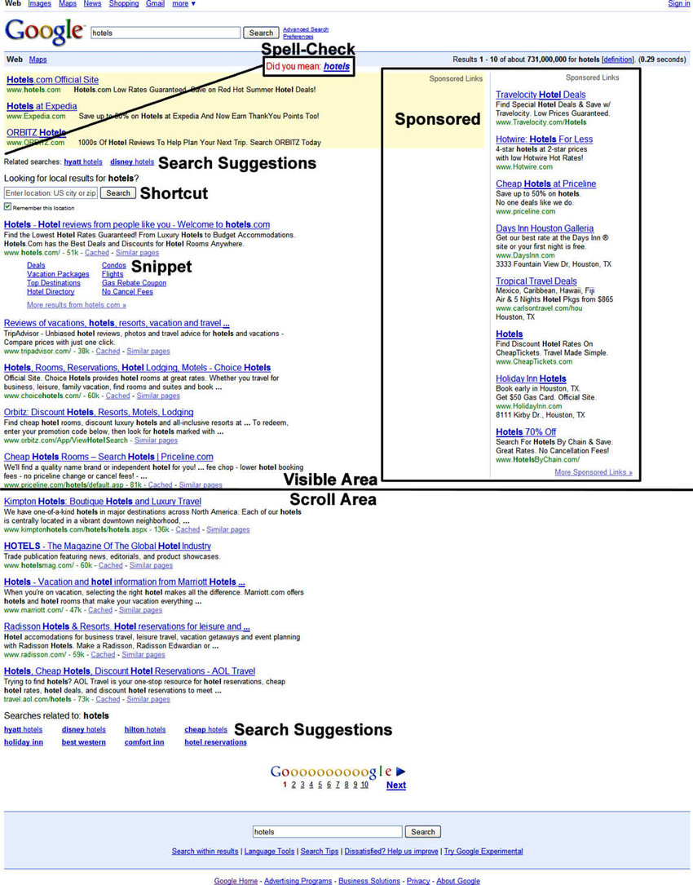

---

For a while, Google Was Really Useful; Sometimes, You Didn't Get the Ads

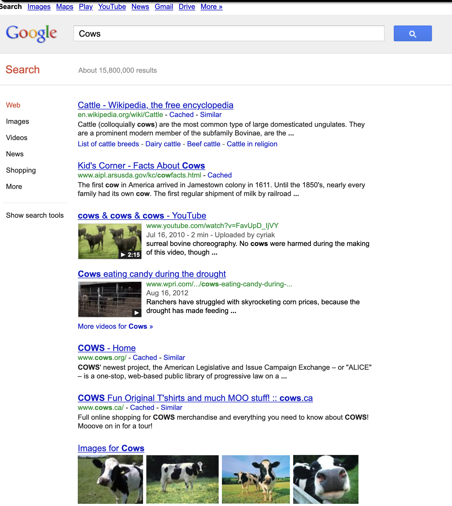

---

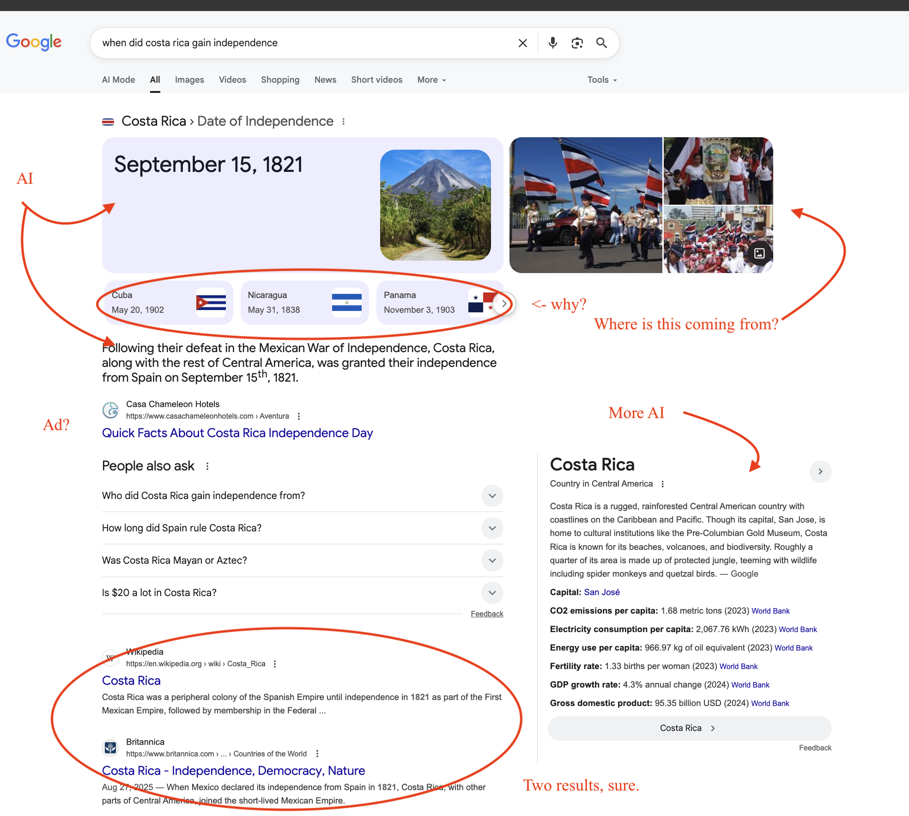

### **Today's Reality**

note:

- First page dominated by ads and AI-generated content
- Genuine expertise buried
- User intent secondary to ad revenue
- Google's search quality has notably declined as advertising revenue has taken priority over user experience. 

---

Everybody forgets the last stage of Enshittification:

> If users can’t leave because everyone else is staying, then when everyone starts to leave, there’s no reason to stay.
> That’s terminal enshittification, the phase when a platform becomes a pile of shit. This phase is usually accompanied by panic, or, more euphemistically, “pivoting.”

---

The Three Criteria That Always Lead To Enshittification:

- lack of competition (Carter, Regan). Biden took steps to reverse this. Trump reverses _that_.
- unrestricted 'twiddling of the knobs' on the service by companies
- criminalization of 'twiddling of the knobs' by _us_

note:
- competition: Google *cleaned up* through advertising, which permitted it to just ...buy anything that remotely was a competitor. Google Graveyard
- tech should make for a low switching cost: the nature of the internet, in that it carries all traffic regardless of who sent it or where it is going - no priority lanes - SHOULD make it easy to code up a competing project. Computers are 'universal turing machines', which means that they can simulate any other machine. Therefore, anything can be reverse engineered. When Facebook decimated Myspace's user base, it reverse engineered how Myspace represented those users' networks, and created an import feature so they could jump ship. Google pretended to be a human to obtain the index of every website's pages. Apple reverse engineered Microsoft Office. The big companies _retroctively_ captured regulation so that what they did to everyone else was made a CRIME if done to them (DRM. Incidentally, the americans made this part of every trade agreement: sign to trade with americans, you make reverse engineering a digital thing a crime). Doctorow: "Bypass app DRM? That’s a DMCA 1201 violation, carrying a sentence of five years in prison and a $500,000 fine, for a first offense.. “App” is just a euphemism a web page skinned with enough “IP” to allow either Apple or Google to send you to prison for Felony Contempt of Business Model"

---

## How Do You Fight Enshittification?

Per Doctorow:

- enforce actual competition law
- technological: adversarial interoperability
- limit 'twiddling'

note:
Individual actions don't work because this is a _systematic_ failing
- by twiddling, he means all of the things these platforms do that violate your privacy, hide the logic for how you're seeing things, all the casino-like manipulation of your attention
- key thing though, you as an individual can't fight. Systematic problems require systematic solutions.

---

## Why Traditional Antitrust Fails

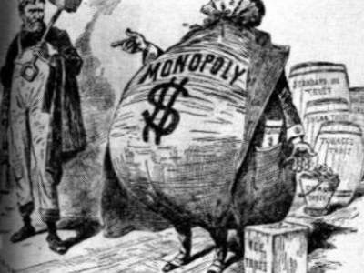

And of course, because the internet emerges in the US, it's American law in particular we have to pay attention to.

note:

Antitrust - you can go all the way back to the price edict of Diocletian, if not further, to find attempts to legislate markets. Thing is, the corporation emerges at the end of the 19th century and becomes the conglomerate in the 20th century, and the laws designed to reign in corporations in the 19th century do not survive into the last quarter of the 20th. A 'trust' was a kind of legal instrument used to obscure who owned what, ie, the existence of monopolies. A variety of laws emerge in the 1890s (most famous, the Sherman acts) which sought to prevent this. Standard Oil was broken up into 34 separate companies in 1913 as a result. BUT, in the 1980s, a series of academics prominently coming from the U of Chicago argued that the foundation of antitrust laws - protection of consumers - didn't mean that monopolies were bad; a monopoly was most efficient self-evidently or it wouldn't become a monopoly. Hence anti-trust was wrong. These people gained influennce under Regan and 'neo-liberalism' approaches, effectively gutting competition law.

**The Competition Myth**
- "Users can switch" ignores network effects
- High barriers to entry for competitors
- Data advantages compound over time

**The Innovation Excuse**
- Platforms claim features require scale
- Argue against "stifling innovation"
- Regulatory capture through lobbying

**The Free Service Defense**
- "It's free, so what's the harm?"
- Ignores attention and data as payment
- Externalizes social and democratic costs

Current antitrust law struggles with platform economics because it focuses on prices rather than quality degradation. Anti-trust laws re-interpreted from promoting competition to saying 'hey the most efficient actor in the market is a big one and so we'll allow mergers'

---

So why am I telling you all this?

- consider conditions under which change occurs
- condsider that the current web is the result of political choices
- consider that the current web is causing serious damage

---

### When I Am Lecturing

- you will hear things you want to know more about. Write those things down. Search out more information.
- you will hear me repeat myself, or return to certain ideas over and over. Those are important. Write those down.
- you will hear things that connect (either directly or indirectly) with things you've read in this class or other classes. Write those down

note:
- DO NOT TRY TO TRANSCRIBE what I say!

---

## Research Precis Dry Run

- [Mapping the Structure of the Archaeological Web](https://intarch.ac.uk/journal/issue39/1/toc.html)
- [Reading Like A Predator](https://hist1900a.netlify.app/docs/read-like-an-academic/)
- [Précis](https://hist1900a.netlify.app/docs/a-research-memo-pr%C3%A9cis/)
- [THOMAS](https://hist1900a.netlify.app/docs/thomas/)
- [Concluding Memo](https://hist1900a.netlify.app/docs/a-research-memo-pr%C3%A9cis/#the-memo-part)

note:
- 4 large groups
- What do you pay attention to, if you're reading like a predator?
- Choose a framework: research memo or THOMAS?
- Select *just a section* of the article to generate a memo for. 
- Me, framapad, suggestions from the audience?
