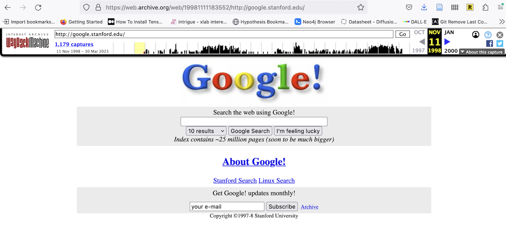
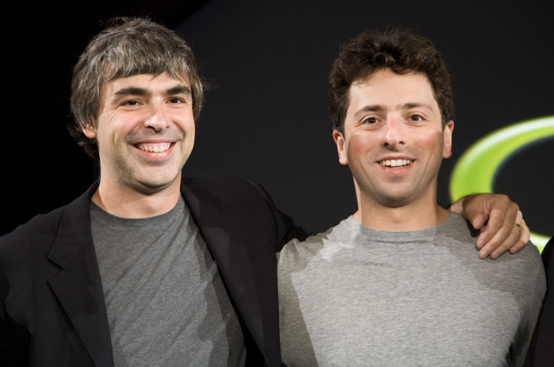
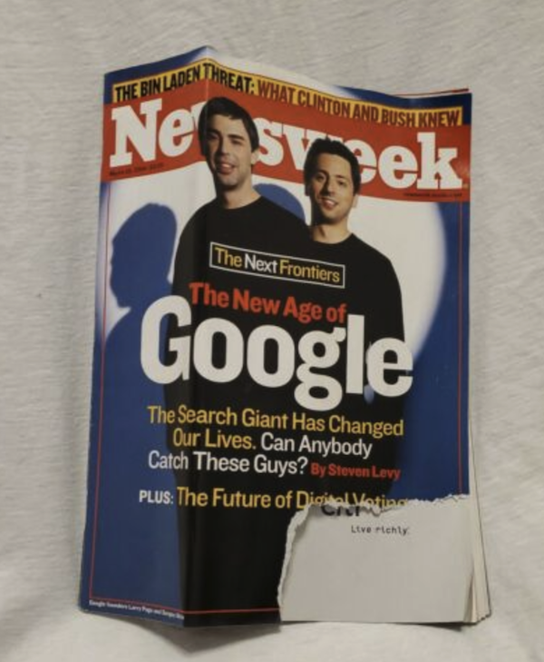
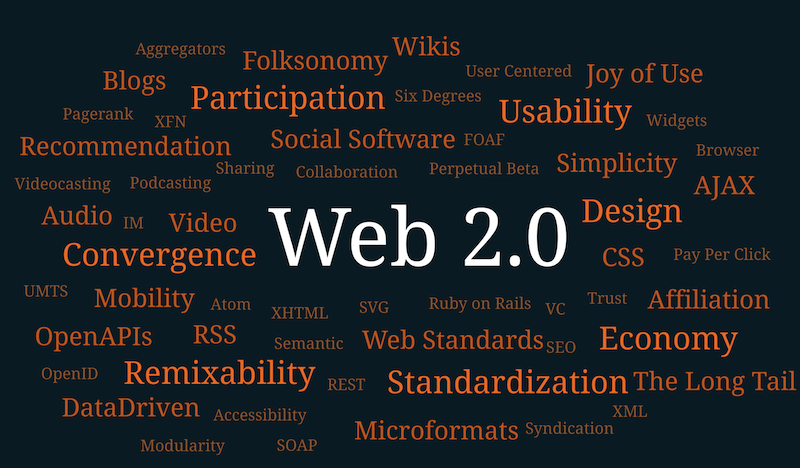
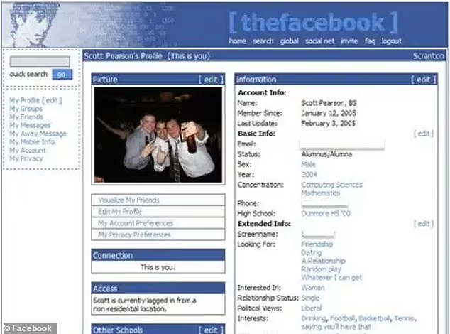
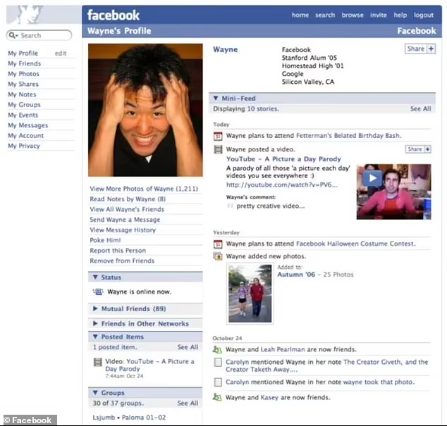
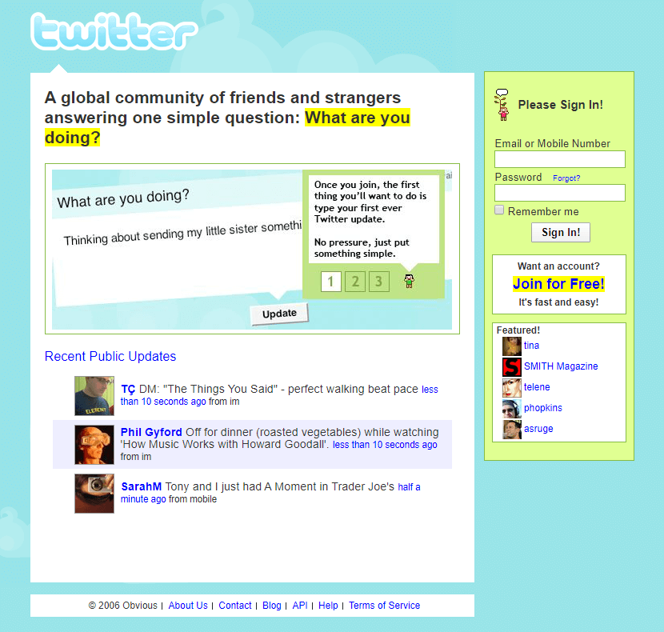
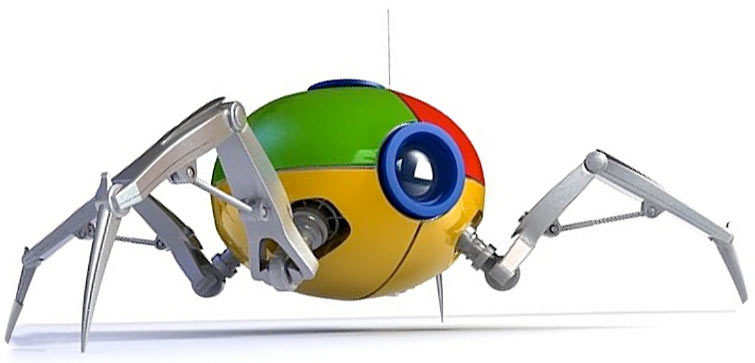
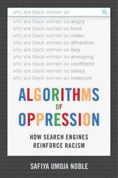
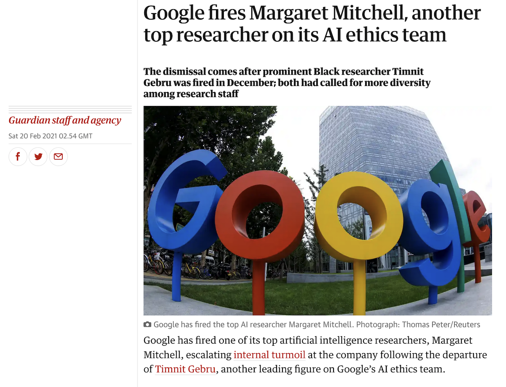

### Questions about the Research Note Dry Run?

How did this make you think differently about what you were reading?

note:
break into 4 again, use the 'all hands' approach for asking question: all hands up. they can answer or say "I don't understand the question" (i'll ask 'why' in response, 'what am i missing') or "I don't know the answer-but I bet [student A] does"

---

# The Golden Age of the Web

Oh the aughts!

note:
era of enshittification has been roughly the last 15 years. So let's look at 2001-2010

---

Actually, we need to go back *just before* the dot com bust and talk about Early Google.

---

For now, suffice it to say, prior to Google, you couldn't find *anything* on the web/internet.

Findability *transformed* everything.

note:
the design of technological things makes the unknown intelligible. Google gave us a language to navigate this vast interconnected space.

---

note:

- starts as Larry Page's dissertation project on mathematics of the web, web as a structured graph in 1996
- inspired by the way citations in academic literature point backwards, and give a sense of what's important;
- Brin writes the webcrawler to put Page's ideas in motion; analyzing the results they came up with pageRank, which they realized would give more useful results than the basic lists currently being used (or which gave highest rank to pages with largest numbers of keywords); cites research, in the eventual publication, by Robin Li, the guy who created Baidu.

---

note:
- originally against advertising, but quickly changed tune by the time they got their company running - formally incorporated in 1998.
- by 1999 indexes 60 million pages; but got some really positive coverage (dot com boom journalism y'all!) . Tried to sell it to Excite.com for $1 million (they got bargained down to $750 000 _but excite still said no_).
- 2000 starts selling advertising against results, where price is bid + per-click rate (and who has the data on per click rate, hmm?) - immediate law suit, advertising company called goto.com sues for patent infringement, settled out of court (goto becomes Overture Services becomes bought by yahoo) for a perpetual license in return for stock.
- 2001 Page screws up enough as CEO that shareholders get Eric Schmidt brought in, famously, as 'parental supervision'
- 2003 Yahoo tries to buy for $3 billion
- 2004 has its IPO; Yahoo quits the partnership with its own search engine
- 2005 valued at 52$ billion
- by 2008 click fraud a big problem for them, they start using cookies to track people; kept this info separate from its other services until 2016 so now you are personally identifiable by your browsing to google
- by the 2010s google buys up other services, or launches similar services, or kills services off; getting in hot water for toxic workplace (sexual misconduct hushed up) or for being involved in seriously dodgy surveillance projects. Several antitrust violations being investigated by 2019 for abuse of monopoly position in search and advertising

---

But when these guys started, no one really knew what 'Google' or 'to google something' was

Note:
scholar John Thompson: “mass communication” -> “the institutionalized production and generalized diffusion of symbolic goods via the  transmission and storage of information/communication." <- 1990. Clear that search engines can fit in this defintion, but that they also don't, in powerful ways. They don't produce narratives or stories. So what are they?

eric schmidt: 'Google is simply an aggregator of information' <- 2006. Yeah, ok.

They are the lens through which, until quite recently, people saw the internet. Google _was_ the internet. 'I got it off google' you probably have said. Don't lie.

search engines do not access the whole web; they do are not consistent; they favour certain kinds of content (especially when using network metrics; they use more than just net statistics these days, so it's hard to say)

"Political  economy suggests that the development of technology is intimately intertwined with the social, political and economic context in which it arises. In the context of capitalism, the quest for profit both directs technical development in information and is supported by them" - The History of the Internet Search Engine:  Navigational Media and the Traffic Commodity, E. Van Couvering 2008

---

<video src="images/pref-attachment.mp4"></video>

note:
network science was super hot in the early 2000s and no one knew quite how to do it; this book was very influential

"Albert-Lásló Barabási (2002) recounts how his team of scientists mapped the Web’s structure to reveal disturbing evidence about the supposed “egalitarianism” of the network. He found that a small number of pages – what he called  “hubs” – are linked to by a great many other pages, while the vast majority of documents are linked to by few or no sites at all. Hubs are very easy to “come across” from anywhere on the Web; they are therefore more likely to be linked to, which further increases their discoverability (the so-called “rich get richer” phenomenon). Meanwhile, a typical page – one pointed to by only couple documents – remains almost impossible to find" - see Barabasi, Linked

---

So what was out there, on the web? 

---

<small><small>As wikipedia says, a word cloud was also a 'typical Web 2.0 phenomenon in itself'.</small></small>

note:
wikipedia: Web 2.0 (also known as participative (or participatory)[1] web and social web)[2] refers to websites that emphasize user-generated content, ease of use, participatory culture, and interoperability (i.e., compatibility with other products, systems, and devices) for end users. 

- **Dot-com Recovery** - Renewed investor confidence post-2001 crash (and all this fiber lying around, cycles to spare)
- **Broadband Adoption** - Always-on internet becomes mainstream
- **Digital Natives** - First generation growing up online
- **Participatory Culture** - Shift from consumption to creation
- **Network Effects** - Platform value increases with user base
- **Venture Capital** - Massive investment in social platforms

## Key Technical Innovations
- **AJAX** - Asynchronous JavaScript enabling dynamic page updates
- **REST APIs** - Standardized web service communication
- **Rich Internet Applications** - Flash, JavaScript frameworks
- **User-Generated Content Platforms** - Blogs, wikis, social networks
- **Mashups** - Combining multiple web services/APIs
- **Tagging & Folksonomy** - User-driven content organization

---

note:
Facebook launches in 2004 as TheFacebook, initially you had to have an academic student email to join
MySpace - Aug 2003
Twitter - March 2006
Youtube - February 2005
Wikipedia - 2001

---

note:
+ early google depends on webcrawlers to travel the links on a webpage; in those days also used to use other signals to ascertain whether or not a site was valuable, but key was PageRank - the weighted count of links pointing to it, and if some of those links came from high pagerank documents those ones would be counted even higher. ie, a popularity contest. Can also think of it as the probability that a random 'surfer' (think about metaphors!!!) would come across a given document. Thus a handful of popular hub websites, and millions of low value sites -> https://en.wikipedia.org/wiki/List_of_most_visited_websites

+ early writing about google framed this process as a kind of democracy. making a hyperlink was a kind of vote, thus google = democracy. But in a real democracy, you don't have the tyranny of the majority. Many argued that pagerank didn't surface material but rather replicated existing biases. vicious circle:"The problem is this: a well-linked page appears prominently on search engines  like Google; this page therefore enjoys greater traffic; and, as users become even   more aware of the site, they link to it on their own pages, increasing the document’s PageRank and visibility even further."
+ advertising - this is huge poison though for that original goal of 'organizing all the world's data' because mixed motivations. Google wants people to stay on their site, click on the advertising, but to do that, the promise is to move you quickly off the site towards your goal. Can't serve both

---

_We expect that advertising funded search engines will be inherently biased towards the advertisers and away from the needs of the consumers. ... Since it is very difficult even for experts to evaluate search engines, search engine bias is particularly insidious ... [and] less blatant bias are likely to be tolerated by the market. (Brin and Page 1998: 17–18)_

note:
they wrote that in the era when page banners were the dominant advertising; but research showed that a) people would click away before the banners could even load and b) they learned to not actually see them.

solution was paid placement, putting links within the search results. Google used to make it very clear where the results were 'organic' vs paid - G and other engines took fees to enhance placement - but now it puts the paid ones right in the most valuable real estate. In 'old' media, the advertisements looked and acted differently than the actual 'content'. Here, not so much.

google runs auctions to generate income on keywords. The data they have about which words are popular and hence more valuable is all proprietary, of course.

---

_As users engage with technologies like search engines, they dynamically co-construct content with the technology itself' - Safiya Noble. [Google Search: Hyper-visibility as a Means of Rendering Black Women and Girls Invisible](https://www.invisibleculturejournal.com/pub/google-search-hypervisibility/release/1)_ 

note:

- but people tend to believe technology is neutral
- google had a snappy slogan 'don't be evil'
- structurally, and algorithmically it pushes towards the status quo
- ...results in a tendency for people to accept what they find as 'truth'.

- Safiya Noble studied google from a perspective based in black intersectional feminism, the way different identities intersect particularly online. 
- She demonstrated that the basic design of what I've described here today, reinforces and supercharges existing prejudices and currents, privileging whiteness. Famously, she searched 'white girls' versus 'black girls', finding nothing but heavily racialized pornography for the latter (and before you ask, yes, she knew how to conduct research online appropriately, taking all necessary precautions to get valid results). 
- In 2011, she writes, 'search results also vary depending on whether filters to screen out pornography are enabled on computers. Information that surfaces to the top of the search pile is not exactly the same for every user in every location, and a variety of commercial advertising, political, social, and economic decisions are linked to the way search results are coded and displayed. At the same time, results are generally quite similar, and complete search personalization—customized to very specific identities, wants and desires—had yet to be developed in 2011. Personal-identity personalization has less impact on a variation in results than generally believed by the public' 

---

note:
in 2007, a company called metaweb launched a project called 'freebase'. it was an open database that expressed data not in relational data, but as a graph: turing born_in england. These are called 'triples'. Expressing information this way is extremely powerful because you don't necessarily need to have a complete schema before hand; and each part of the statement can actually be an address on the web, so you'd have authoritative sources for every kind of statement. Then, instead of keyword searches, you could use the power of network analysis to traverse the graph to surface answers. It allowed user submitted wiki type contributions, and it was an important part of the sort of 'web 2.0' user-generated content sites (all that crowdsourcing). 
It was purchased by Google in 2010. Google incorporates it with things that Google knows. Google announces the knowledge graph in 2012; to begin with, all those little info boxes that pop up when you do a google search with instant answers? Those were powered by the knowledge graph - and often drew on Wikipedia's materials *without attribution.* This had the effect of reducing people's use of wikipedia, which affects its fundraising and the participation of new users. It also drew information from sites that otherwise ranked highly in search, which could be totally gamed.

So why am i telling you this? This - and other sources - becomes the foundation for all of the data being used to train chatbots and large language models. If you have enough data about the same thing but int different languages, you can drop it through a neural network for instance and the network will learn how to transfrom from language 1 to language 2. Other things become feasible. But all of this data, all of this information - scooped up without attribution or recompense.

Google is sensitive about all this. Fired Timnit Gebru https://www.wired.com/story/behind-paper-led-google-researchers-firing/ and Margaret Mitchell for writing a paper pointing out the vast energy implications of this technology, and the ways it can recreate biases, and arguing that google (and other companies) need to better document where training info is coming from. Google fired them. Indeed, microsoft and other companies have all fired their ethics teams in order to roll out these kinds of ai technologies into all sorts of applications without the bother of having someone say, 'should you really do this'?

---

cw: suicide

---

<small><small>Aaron Swartz, 1986-2013. credit: Sage Ross/Creative Commons Attribution-ShareAlike 2.0</small></small>

<ul>
<li class="fragment">helped invent RSS *when he was 14* </li>
<li class="fragment">helped set up Creative Commons *when he was 15* </li>
<li class="fragment">developed Markdown </li>
<li class="fragment">one of the developers of Reddit </li>
<li class="fragment">founder of Demand Progress</li>
</ul>

note:

as founder of demand progress, very active campaigning against bills that sought to expand copyright in ways that would criminalize the ways people treat their own digital data (music, videos especially); promoted net neutrality, the idea that all traffic should be carried regardless of origin or purpose; fought against stop online piracy act which , given the way it was designed, would've made it v. easy for gov't to shut down websites accused of copyright violations. 

in 2008 he downloaded 2.7 million federal court documents (previously, you had to pay for access to this material). FBI investigated, ultimately decided not to prosecute because the documents were actually public in the first pace. But a whole bunch of lawyers and judges got in shit because they hadn't handled confidentiality properly in many court documents in the first place.

in 2011, believing that research **already paid for by the public** should be free, he set up a laptop in a closet at MIT and started downloading academic articles from JSTOR which he then intended to release. 

---

_...the situation Aaron found himself in highlights the injustice of U.S. computer crime laws, and particularly their punishment regimes. Aaron's act was undoubtedly political activism, and taking such an act in the physical world would, at most, have a meant he faced light penalties akin to trespassing as part of a political protest. Because he used a computer, he instead faced long-term incarceration_. [EFF](https://www.eff.org/deeplinks/2013/01/farewell-aaron-swartz)

note:
- Prosecutors charged him with 2 counts of wire fraud and 11 violations of the Computer Fraud and Abuse Act - 
- 1$ million in fines, 35 years in prison, asset forfeiture. Was offered a plea bargain, for 6 months, but he'd have to plead guilty. He made a counter offer; prosecution rejected it. 
- two days later he took his own life. the prosecutors dropped all charges after his death.
- despite MITs public support for open access culture, they never supported Swartz (consider also how often early computer folks just downloaded crap from each other's mainframes)
- after his death, jstor announced they'd make 'more than 4.5 million articles' available for free

---

I might ask you to watch this. You should watch this. [available free through our library](https://ocul-crl.primo.exlibrisgroup.com/permalink/01OCUL_CRL/hgdufh/alma993852416205151)

note:
the law that Swartz prosecuted under started life in part as a response to a panic provoked by the response to WarGames, the 1983 classic starring Matthew Broderick and Ally Scheedy.

---

So what have we got here? 

<ul>
<li class="fragment">Social Media Dominance by a few</li>
<li class="fragment">Creator Economy (kinda)</li>
<li class="fragment">Data as Currency</li>
<li class="fragment">Filter Bubbles</li>
<li class="fragment">Platform Erosion</li>
<li class="fragment">Privacy Erosion</li>
</ul>

note:
- **Social Media Dominance** - Facebook, Twitter, YouTube reshape communication
- **Creator Economy** - New forms of work and monetization
- **Data as Currency** - Personal information becomes valuable asset
- **Filter Bubbles** - Algorithmic content curation creates echo chambers
- **Platform Monopolies** - Winner-take-all network effects
- **Privacy Erosion** - Surveillance capitalism business models emerge

---

What set the stage for all that? 

# The Dot Com Bubble Bursts

...next week, in HIST1900a.

---

Next day: your first precis note.

1. Bring your hilroy exercise book
2. You'll be writing a precis note, using one or the other template 
3. Based on a choice from the readings so far.
