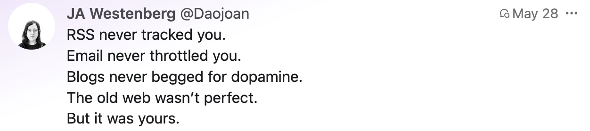
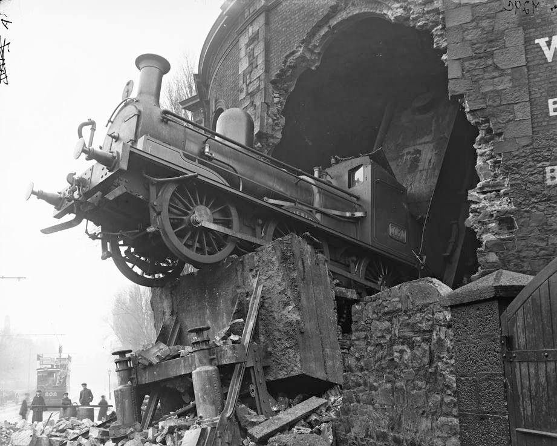
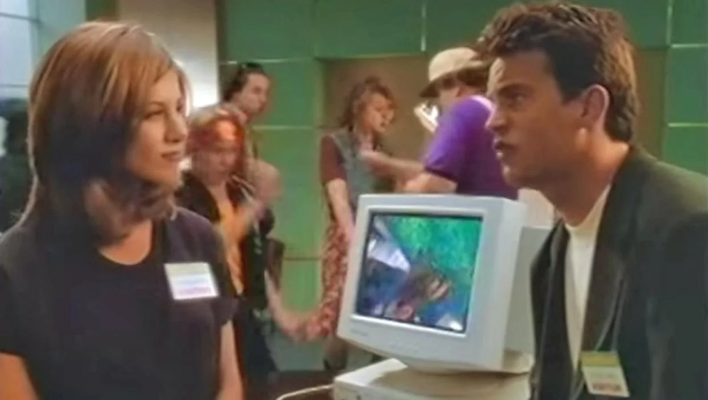
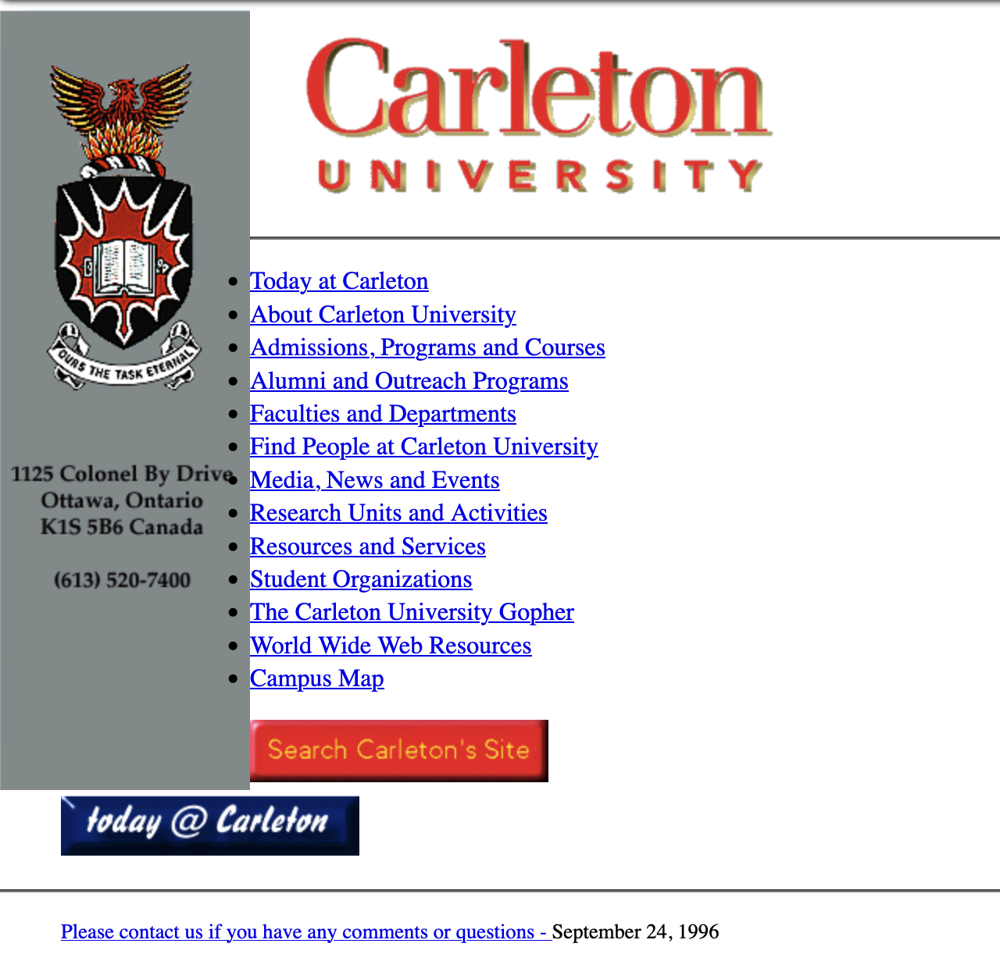
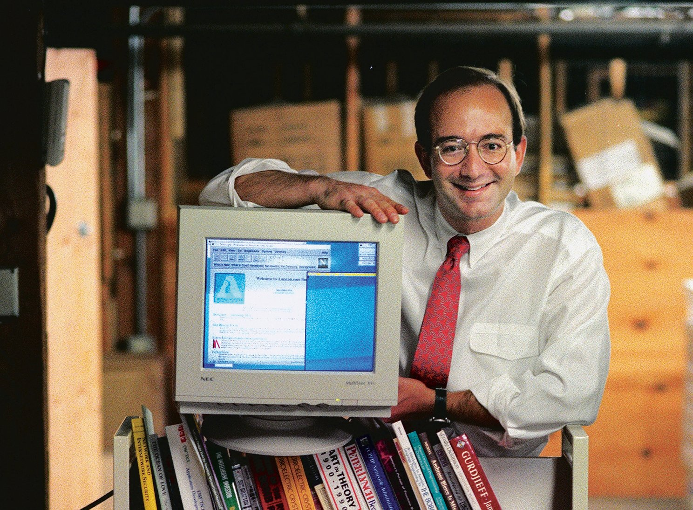
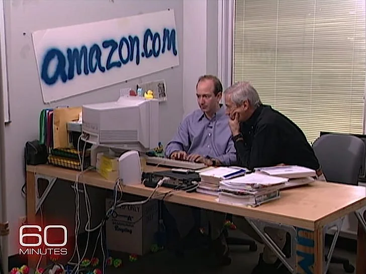
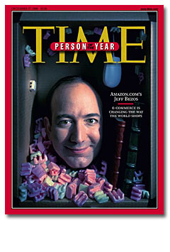
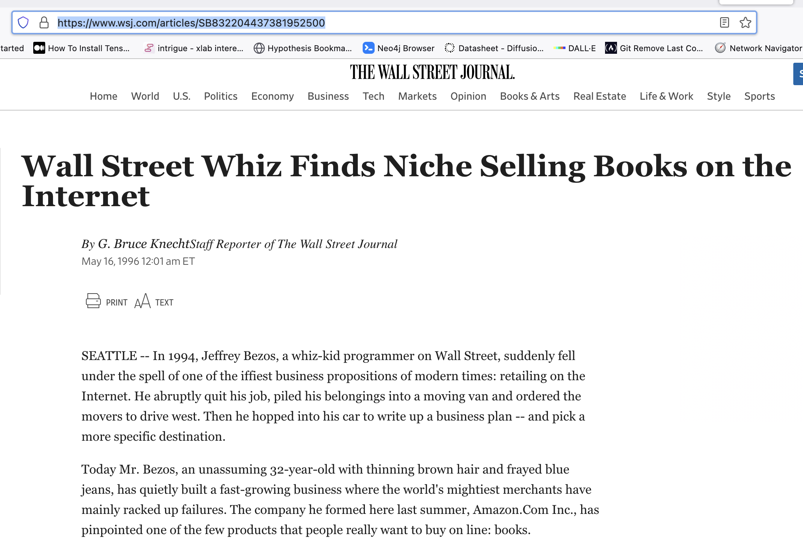
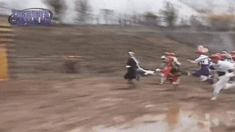
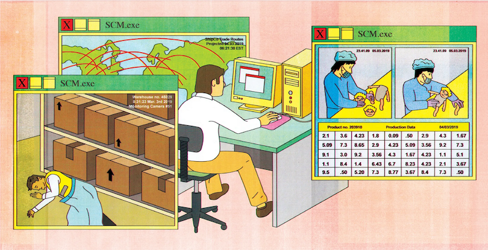

note:

also, a word about last day, what I hope you get out of it, what you will eventually produce, we're working on getting feedback to you... were any of you suprised by how it _felt_ to try to create the memo? People defaulting to 'essays'...

---

What is the greatest movie featuring 'hackers' of the 1990s?

note:
Movies, games, fiction: these all give us a design language for trying to understand something new. What design languages are we drawing on when we talk about the current web?

---

<!-- .slide: data-background="images/ilovethe90s.jpg"  data-background-opacity="0.8" -->

note:
the 90s were ...quite the time. cold war over. soviet union dead. western liberalism seemed to be the thing. new labour in power in the uk in the mid 90s. Although - antitrust regulations being dialed back in the US, regulations preventing monopolies in various communications techs being dialed back, culture war shit is starting to become formalized, strategized, promoted; neoliberalism ascendent 'everything should be subject to market forces'. conditions for exuberant growth. 

I should've started a web company. I should've learned some html. By the time I did, it was too late; but for a brief moment, if you could write some html, people fell all over themselves to give you money. As we'll see when we examine earlier periods, this was all a result of policy and habits (some going back over 100 years) of handing off techs paid for by gov'ts to market operators, who quickly try to corner the market. History doesn't repeat, but it does rhyme.

also, look at BSR site: https://web.archive.org/web/20010202055800/http://www.bsr.ac.uk/ 
god, this is also awful: https://web.archive.org/web/20040612052050/http://www.geocities.com/bristolvillage/ 

---

## The Good Times Come To An End



- March 10, 2000: NASDAQ peaks at 5,048
- By October 2002: 75% decline in value
- Survivors emerge from the wreckage
- expanded technical capacity (fibre, etc) remained
- lots of newly unemployed programmers available

note:

popped when it finally became apparent that the companies created could never return on the money they were burning through

parallels between the first great speculative bubble and the dot com boom

---

<div align="left">

burn rate: "a measure of how fast a company will use up its shareholder capital. If the shareholder capital is exhausted, the company will either have to start making a profit, find additional funding, or close down." [Thanks, Wikipedia!](https://en.wikipedia.org/wiki/Burn_rate)
</div>


note:
Since nobody knew how to make money on the web, the business model shifted from 'how can we sell, so what do we need to build' to, 'how big can this company get and who can I sell this to' - cashing out the shares, ie, who will get left holding the bag?

---

<div align="left">

_A bubble or boom results from an asset being valued above what standard economic valuation would be, and continues to rise in value for a long period of time. There is also in booms and bubbles an element of crowd, or herd, behavior. Individually, one might be deeply skeptical about an investment, but once one sees others taking the risk of investing, and profiting from it, the barriers of experience and common sense come down._ 

Becker, William H. “The Dot.Com Revolution in Historical Perspective.” Entreprises et histoire (Paris), vol. 43, no. 2, 2006, pp. 34–46, https://doi.org/10.3917/eh.043.0034

</div>

---

<div align="left">

Conditions for the bubble

- this time, it's different!
- Joseph Schumpeter, 'Creative Destruction'
- Get Rich Quick

</div>

note:
- costs declining rapidly for computing while capabilities increasing
- communism & USSR defeated
- economic growth & speculative investing
- relaxing of certain fiscal discipline
- belief in market creativity
- hey, to make something new you have to destroy the old - actually a kind of marxist idea
- I also believe baby boomers hitting their 50s trigger desire to finally get rich quick

---

<div align="left">

...a sample...

+ pets.com [wikipedia post-mortem](https://en.wikipedia.org/wiki/Pets.com)
+ webvan.com [wikipedia post-mortem](https://en.wikipedia.org/wiki/Webvan)
+ [wired's ipo watch](https://web.archive.org/web/20000621133949/http://www.wired.com/news/ipo)

_Pets.com bought a **superbowl** commercial in 2000_

</div>

note:
- nobody knew how to make money on the internet, or how to pay back investors. pets.com was launched *without any market research on whether or not people would buy stuff*; Amazon bought 54% right away. They spent millions of dollars on warehouses and shipping infrastructure. Died in November 2000. And webvan promised deliveries anywhere within 30 minutes...
- these companies were trying to build all of the necessary logistics infrastructure from scratch
- superbowl adds cost around $2 million 

---

<!-- .slide: data-background="images/725px-ParisCafeDiscussion.png"  data-background-opacity="0.25" -->


<div align="left">

## plus ça change

I Love the... 1720s?


</div>

note:
introduction of coffee into western europe - a kind of mania for it. you'd go to a public house to drink (wasn't even filtered in those days) - newspapers expensive, some places'd have them up on the wall. a place to discuss, debate, get 'stimulated', hatch plans, schemes, share news, rumors, speculate. 
- London's were all for the most part close to the center of 'The City', the part within the original roman 'square mile', near the center of state power & finance
- this was the same period where limited stock companies first emerge (we will see that the emergence of new corporate structures in the 19th century played a big role in telegraph/telephone/first internet, later on) so people trading stock tips, investment advice, insider trading - which wasn't a crime yet - things so new no categories or theories to guide them 
- so a change in communication abilities plays a part

- British gov't needed refinancing of its debt after various wars
- 1711 South Seas Company has a promised monopoly on trade (slaving) to South America (the war of the spanish succession was in full swing, which kept UK out of south american trade; thought was it'd end soon and they'd all be rich). public/private partnership. by buying the national debt (at hugely reduced valuation), The gov't would pay the company interst on the debt, and the interest would be passed on to shareholders. To generate income, they also got the monopoly on the trade, and they promised huge interest rates on their stocks as a result. insider trading, bribes ahoy!
- Nobody quite sure what the company does (basically, it was a kind of ponzi scheme); 

- stock market hasn't been around very long, or how one makes money there
- nobody entirely sure what the SS company does
- but its value and its stocks are the subject of discussion and hype in the coffee houses
- people bought and sold the shares expecting the value could only go up in this 'new economy' (make HUGE profits from slaving - though the company hadn't achieved that yet)
- celebrity influencers were 'persuaded' to 'buy' shares - the SS company gifted them with stock - the influencer, instead of paying for the share, would hold on to them because they had the option of 'selling' the share back at higher value - the appearance of enormous profit! These 'celebrities' were politicians, nobles (right up to the King).
- 'Look at how much those canny investors made, you can too!'. Isaac Newton lost a fortune on these stocks when the bubble burst (when it became obvious the company had no way of making money)
- I am drawing a direct parallel with dot com mania. Do you see the parallels?

---

<div align="left">

## Stoking Dot Com Mania Amongst Us Regular Folks

"Show us how to surf the net": 

<iframe width="560" height="315" src="https://www.youtube.com/embed/Y0EXga2hEIs?si=Ydgy7ngLSKojat3-" title="YouTube video player" frameborder="0" allow="accelerometer; autoplay; clipboard-write; encrypted-media; gyroscope; picture-in-picture; web-share" referrerpolicy="strict-origin-when-cross-origin" allowfullscreen></iframe>

What strikes you about this clip?

</div>

note:
- "What value does a producer add in this world?" <- hmm
- 'this is the web in its larval state, what this can transform into is video on demand'

This is a course on the history of the internet. The things that created a mania for the Web by default make for the expansion of the internet

---

Bill Gates buys some Friends:



note:

- Fueled by the novelty of it all; the glamour of movie 'hackers'; the promise that you could set yourself up and be whoever you wanted; windows 95 (which also bundled a browser called Explorer)

---

- 1994 – Pizza Hut launches online store
- 1995 – Amazon, eBay, Craigslist, Match.com launch
- 1996 – Hotmail debuts (email largely a university/gov't thing until)
- 1997 – Google.com is registered as a domain; Netflix launches DVD rentals online
- 1998 – Google Search is founded and quickly rises over other engines

---

And it was all so ...easy. Potentially.

```
<head>
<title>My wicked cool page</title>
</head>
<body>
<h1>Welcome!</h1>
<p>My name is..... </p>
</body>
```

note:
change the headline on a newspaper via inspector. a website comes to *you*, not the other way around. By design, you should be able to control how the information turns up chez you! That was in fact a feature of the earliest browsers, but since people were casting around for metaphors to undertand things, print/broadcast wins out, not this 'hypertext' nonsense...

---

Your university would give you the basic hosting you needed, too. Often.



[1996 Carleton](https://web.archive.org/web/19970605095013/http://www.carleton.ca/)

note:
people learned to do this using the technology provided to them by universities (NOT private industry!)
you needed a host, you needed to understand earlier internet technology protocols like ftp, you needed to know how to write hypertext markup language
-universities used to provide hosting space for faculty and students. Carleton currently does not.

---

<div align="left">

A Key Moment in Inflating the Bubble: Amazon becomes Amazon.com

- Starts with $250,000 loan from parents
- Develops a parasitic model: exploit existing infrastructure
- May 16, 1996: WSJ front page changes everything
- Alan Greenspan: Dec 5, 1996, coins 'irrational exuberance'

</div>

note:
this was also the start of the 24 hr finance tv shows etc; Greenspan made his remarks at a time of day when the Japanese stock market was open, which then apparently reacted immediately, wiping 6% off the value

---

 



note:
- Bezos - electrical engineering & comp sci from princeton, 1986
- joins wall street company, writes software to provide online access for customers
- joins a hedge fund using computers to make rapid trades; in 94 is tasked to figure out how to make money from the web 
- decides that there are many areas where the 'real world' market is disjointed and could be exploited.

---



Why Books?

<ul>
<li class="fragment">large industry ($25 billion in annual sales)</li>
<li class="fragment">large number of publishers (> 50 000 in US)</li>
<li class="fragment">independent book shops at retail; 2 chains < 25% of retail market</li>
<li class="fragment">chains had stores, assets, employees, warehouses => costs</li>
<li class="fragment">small independents had even higher cost per book than chains</li>
</ul>

note:
Bezos, the small entrpreneur?
- Gets a loan of $250 000 from **his parents**. 
- launches in 1995
- has ~ 1$ million in seed funds from local investors as well

leans heavily on the funds and labour of his (now ex-)wife Mackenzie Scott

sets up shop in Seattle in close proximity to an existing book distribution warehouse. Also, washington had no sales tax. Bezos is always looking out for number 1.

---

Business model

<ul>
	<li class="fragment">Low prices?</li>
		<ul>
			<li class="fragment">nope</li>
		</ul>
	<li class="fragment"> buy your book online, they get it from the local warehouse, repackage it, and then mail it to you (taking advantage of existing gov't paid for infrastructure)</li>
</ul>

note:
Amazon burning through cash. First year had sales of $511 000 but expenses of $800 000. Labour intensive business.

- Bezos figures the only way he can make money is to expand volume; figures he can achieve that by 1997 if he can make sales of $10 million
- amazon's genius was that it was parasitical - it exploited weaknesses and used other systems (post office) for itself

---

So... where's the exuberance?

- enter the VC

note:
- venture capitalists: one of the first VC firms on the west coast invested in Fairchild Semiconductor and Intel;
- sometimes VC's were former entrpreneurs who had once made things. one such was Kleiner Perkins Caulfiedl & Byers. Eugene Kleiner had been a founder of Fairchild Semiconductor, for instance.
- VCs often structured as partnerships; partners put their own money in to whatever they invest in. They have 'limited partnerships' where they take *other* people's money and invest that too - they charge the limited partners a fee of 1-2% to **manage** their funds, and then 20-30% profits due to their limited partners TOO.
- What kinds of incentives does this create?
- Bezos seeks these people out; best offer he gets, for a 10% stake in the business, was $1 million (hence, VC figures the business is only good for 10 million). Bezos refuses, wants more.

---

## 16 May, 1996

Amazon.com gets a front page article on the Wall Street Journal:



note:
Talk about priming the bump - WSJ had 2 million copies a day circulation - sales **doubled** the day this appear (NB the connection between flattering media & sales: OpenAI etc, learning from the enshittification of online 'engagement' realize there's more money to be made by promoting FEAR and DISASTER if people don't buy, use their products!)
- the next VC offer was for $50 million. Bezos eventually gets the $60 million evaluation he wants, getting $8 million in cash from Keliner Perkins.
- by end of 1996, Amazon has sales of $8 million dollars: STILL NOT PROFITABLE 
- amazon had to pay about 16$ per book for buying/shipping; advertising cost about $8 per book; overhead $1 per book - each book cost an average of $25 to sell, for amazon BUT the average return on any given book was $20 - merely selling stuff isn't enough.
- but Bezos is everywhere, giving talks, publicity, creating an aura of invicibility
- Decides that he must rapidly expand to get bigger than any rival (thus killing rivals) - 'winner take all strategy' - the idea that if you get big enough, customers have no choice but to deal with you, no matter what, the switching costs are too high (which we saw becomes a key part of the enshittification)
- goes public: 23 million shares authorized, 3 million put up for sale at $18 per share (quick, 3 million x 18 is....?) = 54 million; for a total market capitalization of 414 million.

---



### Gold Rush Time

note: gold rush time

- in 1999, priceline.com - a company that resells airline tickets (it just sells you tickets that it grabs from the existing ticketing system, exploiting regional variations and other incongruities some accidental, many designed) has an IPO - produces 9.8 billion on the first day - more than what the 3 biggest actual airlines with staff, airplanes, hangers, infrastructure were valued - it also lost 114 million dollars in its first year
- strategy emerges - get vc funding; spend to get big; don't worry about how much you're burning through, get those eyeballs in front! cash out in the IPO.
- it's 1720 all over again, and popular press, tv, media are playing the role that the coffee houses once played.
- the PARTIES of those days! The gimmicks! Shopify had an actual *slide* in its original office - I saw it in its current ottawa offices about six or seven years ago, so dusty, so forlorn and abandoned, so... weeenie. 
- paper millionaires - many staff being paid in stock options, but they can't cash these out for one year - so obviously, in one year's time, something is going to happen...

---

When the dust settles, few are standing.

...amazon

...ebay

...nupedia / wikipedia

note:
- bubble bursts in march 2000. several things happened - japanese stockmarket entered a technical recession; major finance magazine ran a story telling investors that dot com companies were burning money and running out of cash, predicting bankruptcy; anti-trust actions continued to harry microsoft. By the time pets.com went under in november 2000, trillions of dollars had been wiped out.
- web 1.0 tried to make money by selling actual things; previous residents of 'the internet' were very much against that by the way!
- clear that web wasn't like TV, and so models from print (classifieds, banners, adverts) imported
- so trying to get eyeballs in front of adverts; actually tracking individuals was both technologically not possible but morally repugnant at first - 'big brother'
- had to get people habituated. crazy advertising spends - superbowl ads!
- govt encourages both through fiscal policy and also for their own vindication for earlier tech spending: see, it was worth it! It's on this point we'll return later on to see how Al Gore 'invented' the internet
- 'new economy' rhetoric

---



lasting impact of the dot com boom 
- the internetification of logistics
- emergence of 'content'
- advertising into everything (that vc money gotta get rewarded)

note:

- build-out of capacity, then bust of companies using it: infrastructure remains. Which permits the web 2.0 phenomena of user-generated content (rather than nerds hard-coding their own websites)

miriam's article - supply chain management https://www.newyorker.com/science/elements/the-software-that-shapes-workers-lives

- supply chain management software - SAP - Systeme, Anverdungen und Produkte - systems, applications, products. Series of modules that speak to other modules/installations of the software, such that your local walmart orders diapers, eventually a factory somewhere starts producing the necessary plastic, fabric, elastic, polymer absorbent pads, another schedules assembly, somewhere else cardboard boxes are designed, somewhere else printed... tries to mitigate the 'bullwhip' effect - local manager decides to order 50 boxes instead of 25, diaper company orders 100 boxes to be made, on the safe side... etc. But this also has the effect of impact on workers lives - rescheduling shifts, hours, break time... early web services like pets.com bought up warehousing and logistics;

amazon parasitized existing systems; ultimately, the solutions that we have right now emerge in parallel to the development of retailing online and the internetification of formerly independent chains. You can't actually know, in this system, the ultimate origin of products!