A few things.

- etiquette
- volunteer note-taker

---


<!-- .slide: data-background="images/ilovethe90s.jpg"  data-background-opacity="0.4" -->

# Web 1.0: Of GeoCities, Gophers, and Pretty Text

note: what was the experience of this all like?

---

## On Tap Today:
- Gopher
- Lists and Search and Browsers
- Homesteading and Community
- Section 230


---

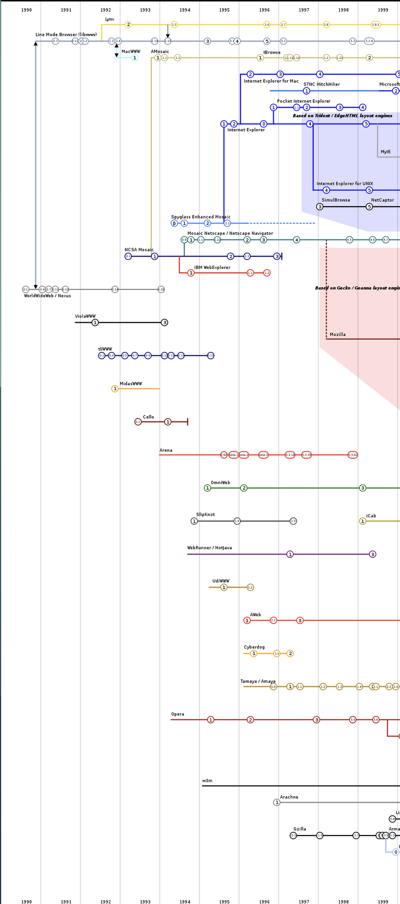

---


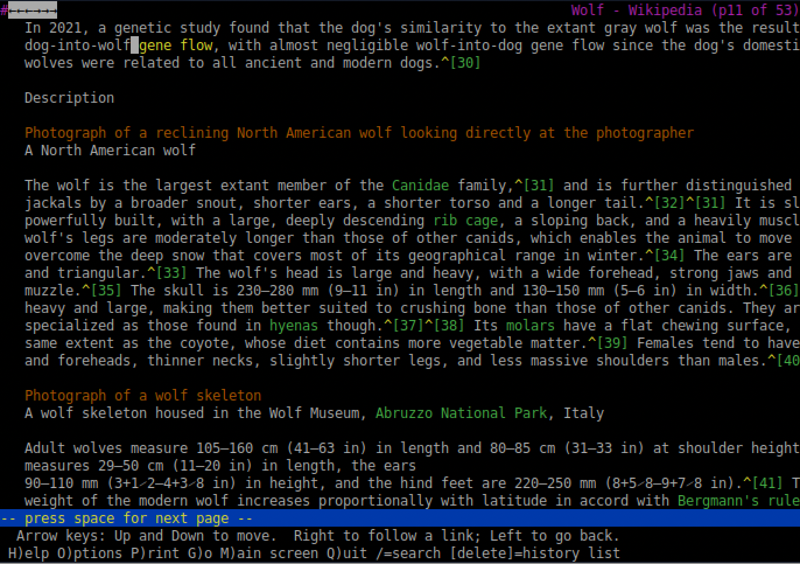

There was a web that *wasn't* graphics; think of these as the [incunabula](https://en.wikipedia.org/wiki/Incunable) of the web...

[https://www.w3.org/History/19921103-hypertext/hypertext/WWW/TheProject.html](https://www.w3.org/History/19921103-hypertext/hypertext/WWW/TheProject.html)

[Lynx Web Browser: B1992; d?](https://en.wikipedia.org/wiki/Lynx_(web_browser))

note:
This was the first browser I ever used!

---


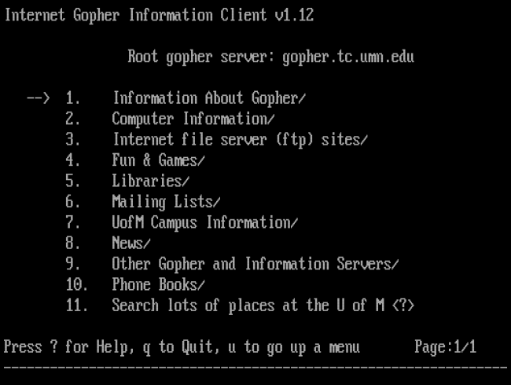

[It's still out there](https://gopher.floodgap.com/gopher/gw?=gopher.floodgap.com+70+302f676f706865722f72656c6576616e63652e747874)

note:
In many ways, browsers just wrapped gopherspace with some nice graphics; gopher was more popular, at the start of the web, than the browsers, but the people behind the gopher software  - a team a U Minnesota - couldn't keep up with demand (including support), and they tried to commercialize it - so people went with the free stuff instead. Incidentally, a webbrowser could open the gopher protocol (just used a URL with gopher://name-of-gopher-site ) . Lead inventor of gopher, mark cahill, once said "another reason I’m okay with the web beating out Gopher, I don’t have things like Facebook and its weaponized surveillance platform on my conscience directly.” You can still use gopher, even though modern browsers no longer support it; see https://gopher.floodgap.com/overbite/

---

<div align="left"><small><small>

- 'protocol': an agreed upon set of methods (both hardware and software) for exchanging information through a physical medium (the internet, the web: physics are still involved!)

- 'Gopher': a protocol for accessing computers that are interconnected, where those interconnections are mediated by the `Internet Protocol` that prioritizes a menu driven system of file search, display, and transmission

- 'Hyptertext Transfer Protocol' (http): a protocol for doing the same thing, via graphical user interface

- 'FTP': File transfer protocol. Born: 1971!!

</small></small>
</div>

---

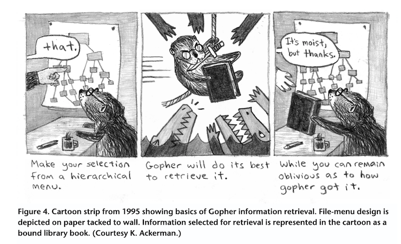


note:

Before there was the graphical web, there was the textual... and you'd gopher stuff. Development and design led by Mark McCahill, University of Minnesota

And before there was Gopher, from the university of Minnesota (go golden gophers!) there was Archie, from McGill

They developed software to systematize, arrange, and contextualize data like documents, audio files, and images

Fans of Gopher say "the Web won and Gopher lost because the Web could display vibrant images of, for example, hand-woven Turkish rugs, animated glyphs of mice stuffing email into virtual mailboxes, and blinking advertising banners."

Gopher pages could in fact display images, and many people had limited bandwidth and turned images off when using Mosaic and other http protocols. So there's a mystery here. Why did the graphical web win over the textual web?

The underlying discover mechanism, perhaps. Gopher was hierarchical, nested, following paths (like how your own computer organizes information, though it has web-like discovery features meshed on top of it) while the Web-via-hypertext was non-linear, non-heirarchical, and in some respects flat (but this ignores things like preferential attachment, and then the later power of search engines to channel/canalize your experience of the web)

See? Metaphors matter. 

---

<div align="left">

The battle on campus for computing's soul: mainframes, or pcs?

"My idea of a good time is to just go wander around where there is a big collection of books on the shelf next to each other and I find the one I was looking for and then I look at some others really close to it. … Browsing." - Mark McCahill

</div>

note:
McCahill and company were also developing software to make using the internet's first killer app - email (which appears in the 1980s) easier to use. And this depended on how people envisioned computing should be used. Should it all be on a single monstrous machine - the mainframe - that we all telnet (another protocol) into from terminals? Or should we have something distributed across personal computers? The answer to that question dictated the various engineering choices to be made. When I was in university, I was there right at the moment my school transitioned from terminals to pcs. 

so this is what they did: they proposed a pc solution, where individual users had the autonomy: "They recom-
mended building a Gopher system composed of three unique parts: clients, servers, and the Gopher protocol. The client would become the user interface; the server would control document indexing and retrieval; and the protocol would govern communications between clients and servers. Any client that could translate the user’s specific query into the protocol language, and any server answering the request coded using the Gopher protocol, could be incorporated into the system" AND it deliberately minimized cpu and bandwidth. It was also inspired, again, by STeve Jobs' NeXT computer which had a full-text search system built into it (which was entirely novel, in those days)

---

<div align="left">

Why was this important? 

Because FTP sucks.

</div>

note:
By the early 1990s, the internet had grown to over 100 000 connected hosts (which themselves might be connected to a local network of some kind), and the information was mostly unfindable unless you knew the exact file structure and location of things. This is why in Wargames you see Matthew Broderick downloading directory structures to try to find things. So while PCs and Macs were becoming quite common place, to actually do anything on the internet, you had to understand Unix, you had to know ftp addresses, you had to be quite technically proficient. Gopher was a huge step-change in accessibility. I mentioned 'Archie' before - that was a protocol from McGill that worked with ftp indexes. "Archie was an application
for finding specific anonymous FTP servers with data files of particular interest to the user. Archie automatically trolled the Internet for anonymous FTP information, presenting the user with a telnet-based client with a text-based indexed directory of filenames"

...and gopher was made available to other universities by being placed on an FTP server, with an announcement to a bulletin board service!

---

In 1993, Gopher was cool enough that an MTV vj set up a gopher server _live on tv_

---


Veronica is born in 1992

note:
Since gopher was hierarchical, it was possible to write a recursive piece of code to find all the gophers in the world and organize them. And if Archie sorted out FTP, then Veronica was the obvious choice for gopher. By 1994, Veronica was handling a million search requests a month; when it first ran in 1992, it took 30 hours for it to index *all of gopherspace* then.

---

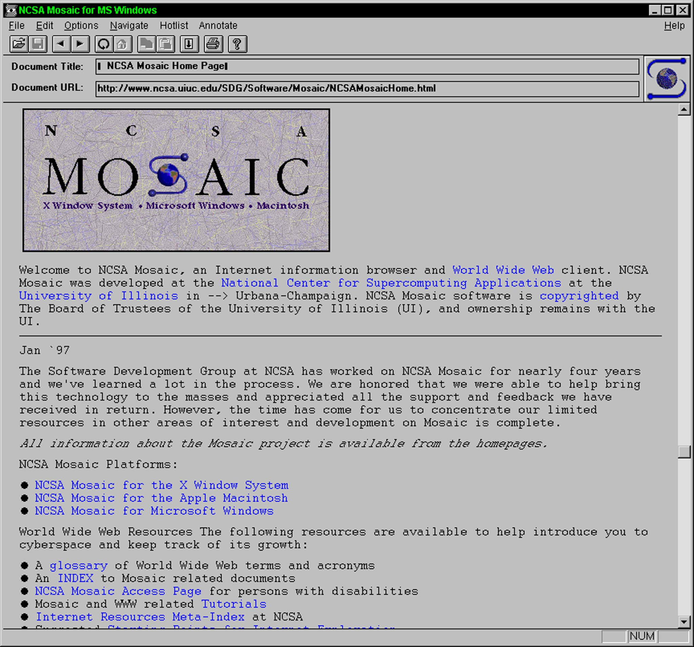

note:

- 1993 NCSA Mosaic Browser released by UIUC's National Center for Supercomputing Applications
- 1994 Mosaic Communications Corporation founded; releases Mosaic Netscape 0.9 in October on 'try before you buy' grounds; default website: netscape.com
- The web protocol surpasses Gopher protocol for amount of information exchanged in 1994.
- instead of command line interface with internet, or a series of menus, gives a graphical user interface for web pages
- instant lawsuit with NCSA; company changes name to Netscape

---

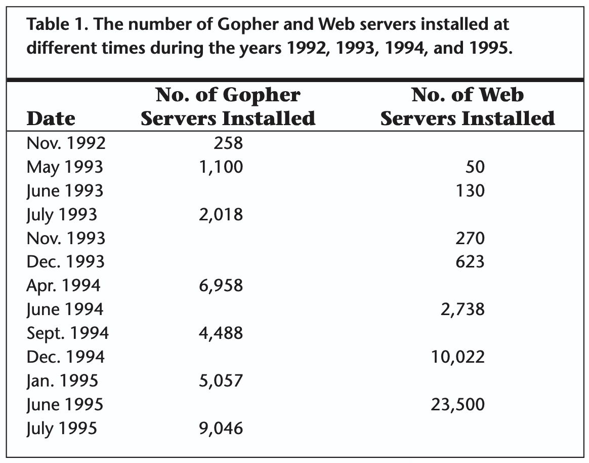

note:
part of the problem for gopher was that there was no obvious way to commercialize it, and the cost of supporting it, fixing it, keeping it running outpaced available funds. In 1993 they tried to make it free for university use but license it for commercial use (thus brining in income) and their userbase revolted. And then no one could agree on how to pay the fee (or how much it should be). But the impact of this in the decline of gopher is debateable; other protocols struggling the same way at the time. 

What about pretty pictures? McCahill thought the web was ugly, and preferred to provide links to properly designed graphical files that you could download to look at. FWIW, Tim Berners-Lee also hated graphics in webpages at first. A bigger factor in the decline is whether you think information is ridigly heirarchical, or whether you think in terms of networks of associations. If the latter, then hyptertext- even the impoverished version that TBL put together - is the winner. And enough people seemed to find that. Perhaps this is the first blow against authority, established ways of knowing? Gopher debates end up spiralling around trying to find the one true way to organize everything - and most people who built gopher sites were actually crap at maintaining the kinds of heirarchies that made sense..

---

<div align="left">

But... we ended up with 'portals' like Yahoo (nested hierarchies), and Google killed off Veronica to do the same job.

And indeed, a lot of the early web browsers were just reskinned gopher sites.

</div>

---


note:
- goes public in 1995; initial IPO doubles on first day of trading: $2.2 billion dollars
- buys up competition, buys up developers, buys up tech
- incorporates email, newsreaders, develops a plugin interface to allow others to extend function
- one of the first licensers of Java, allowing virtual machine tech
- Sun & Netscape develop javascript, allowing dynamic webpages

---


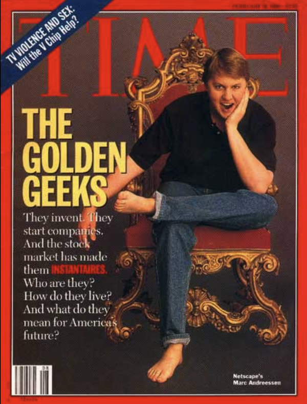

note:
- by 1996, netscape has 38 million users
- becoming apparent that a browser could be a do-anything platform; is getting bundeled in operating systems across a wide variety of manufacturers
- existential risk for Microsoft
- notice that Andreesen, who made his fortune by monetizing university-developed tech, is now a pro-Trump guy (money loves money)

---


All browsers kinda look the same...

(Incidentally, if you're into design history, this site seems helpful [https://www.versionmuseum.com/](https://www.versionmuseum.com))

note:
- Microsoft licenses original software from NCSA and starts developing Explorer
- Microsoft wants to kill Netscape. Keeps Explorer Free, even for business, heavy lobbying of manfuacturers and ISPs to bundle Explorer rather than Netscape
- tightly integrating Explorer into Windows OS
- notice the way netscape has buttons to what's new, what's cool: money money money. default settings MATTER

---


---

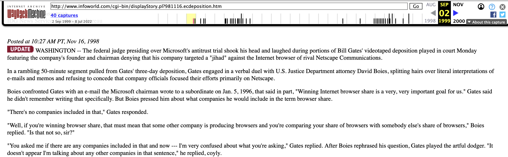

note:
- triggers an anti-trust investigation
- by 1998 declining growth and losses
- open sources all of its code in an effort to regain share
- netscape purchased by America Online
- Netscape dwindles & dies by 08.

---

## moz://a


note:

- MozillaFoundation (non profit); Mozilla Corporation takes the open source Netscape code and begins to develop Firefox
- 'mozilla' was the name of the mascot for netscape: mosaic + godzilla; 
- aim to reduce the cruft and bloat and make a fast efficient browser
- first browser, Phoenix, released in 2002; trademark dispute; renamed Firefox in 2004
- uses Google Search as default

---

### Yahoo's original URL: akebono.stanford.edu/~yahoo

That sweet sweet 1994 design


note:
notice that 'what's new', 'what's cool' again... notice the number of entries listed
 yahoo founded in 1994
- began as a collection of Jerry Yang and David Filo's favourite websites: "Jerry and David's Guide to the World Wide Web"
- rename 'Yet Another Hierarchical Officious Oracle' - Yahoo! - or could just be the rude, uncouth as first used in Gulliver's Travels. incorporated in 1995
https://www.wired.com/2015/11/once-upon-a-time-yahoo-was-the-most-important-internet-company/

- handbuilt hierarchical directory of sites
- used a webcrawler & tips from users; twenty human classifieres would classify
- Cool Site Of The Day!

---

1996:

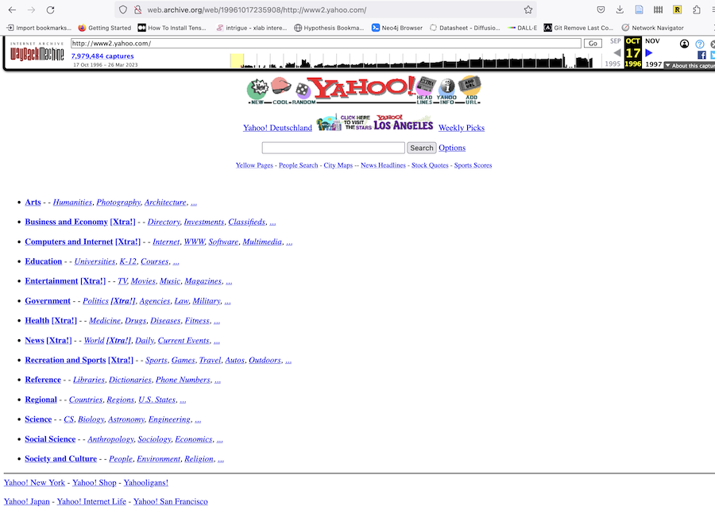

note:
- notice how I also rely on the internet archive a lot. That's a major source for web history
- anyway,
- in 2000 yahoo signs a deal to use Google's search technology
- dotcom crash: stock drops from $119 to $4.
- Yahoo! and the way it bought up services and made licensing deals tried to be a one-stop-for-everything. A website doing all the things we now use a device for: the smartphone. But fundamentally... a souped up bulletin board service maybe.

Important!
the kind of thing that was once the province of library, secretaries - field gendered heavily feminine gets recoded masculine when money is at stake

---

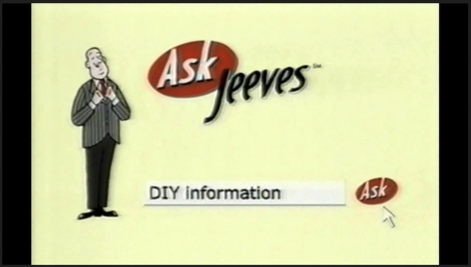

You can [watch the commerical](https://www.youtube.com/watch?v=ROojlQt8ZDc) later, if you want.

Riffing on bulletin board services, many services framed themselves as 'portals'

note:
- hand curated lists of 'places'
- Ask Jeeves - 1997 - natural language search engine
- your 'maps of content' function as portals.

Bulletin board services pretty much die off by 1994 by the way; we'll come back to those for they were the internet of the 1980s!

---

'Portal'. Sounds.... wizardy.

- quick, list some metaphors.

note:
grasping for a design language

---

- 1995: a big year, no doubt about it.
- 1990 - 1995: some important stuff happening behind the scenes

--

- 1990: Arpanet shuts down: the 'first' network (ish.)
- 1991: many other smaller, regional networks become internetworked when the NSF removes commercial restrictions on _its_ network backbone connecting its supercomputer hubs
- 1992 - 1995: see last day's lecture and earlier today!
- 1998: ICANN founded: private company under contract to US Gov't, to organize names/numbers for addresses; in 2016 governance of ICANN transitioned to an international stakeholder community

---

### Screw It. 
## Let's Build A Website

---

- you need a text editor, not a wordprocessor. 
- make a folder on your machine. Call it `my-nifty-website`
- open the text editor, and get ready to type.

---

<div align="left">

```html
<!DOCTYPE html>
<html lang="en">
<head>
    <meta charset="UTF-8">
    <title>Hello World Demo</title>
    <link rel="stylesheet" href="styles.css">
</head>
<body>
    <h1>Hello World!</h1>
    <p>I am ON THE WEB.</p>
    <p>And this is a <a href="https://carleton.ca"> hyperlink to Carleton</a></p>
</body>
</html>
```

Save that in your folder as `index.html`. Double click on it. Ta da!

</div>

---

<div align="left">

```css
h1 {
    color: #2c3e50;
    font-family: Arial, sans-serif;
    text-align: center;
    font-size: 2.5em;
    margin-top: 50px;
    text-shadow: 2px 2px 4px rgba(0,0,0,0.1);
}

p {
    color: #34495e;
    font-family: Arial, sans-serif;
    text-align: center;
    font-size: 1.2em;
    line-height: 1.6;
    max-width: 600px;
    margin: 20px auto;
    padding: 0 20px;
}
```
</div>

---

<div align = "left">

- Host the damned thing

- eg https://app.netlify.com/drop 

Now wasn't that easy? Why does this matter?

</div>

note:

and if you want to make that available online, you place it on a connected computer that knows how to handle requests: a server. 

also, this is one way; true hypertext could assemble itself based on how you interacted with it.

---

## Geocities

The Web is a _Place_

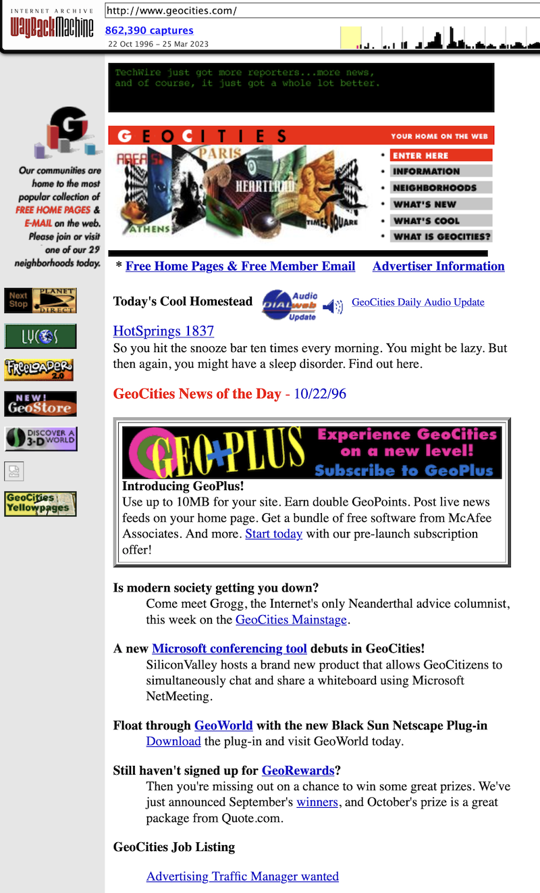

note:
Where did you go if you wanted to be *part* of the Web?

- angelfire.com
- tripod.com
- geocities.com

When we look at the internet before the web, we'll also be considering the way video games worked in those days, because games gave people a 'design language' for understanding new interfaces. one of the early dominant metaphors of gaming and networked gaming revolved around place based, spatial metaphors, movement over links. I think you can trace a line from that to this.

founded by David Bohnett in 1994, after death of his partner; launched as Beverly Hills Internet - would let users create free webpages. Ian Milligan argues this original geographic naming speaks to 'the desire for community that lay at the heart of the undertaking'

Bohnett 'We all have something to share with each other, which enriches both their lives and ours as well'' ... which he explicitly connected with his own identity as a gay man: 'part of a minority that \[does not have\] an exqual voice in society'.  Other competitors with free hosting: tripod.com (1994), angelfire.com(1996); Geocities unique though in its geographic metaphors

- by summer of 1995 had 1400 websites on it; by 1998 was gaining 18000 new users a day.
- shift in public perception of the web as something passively consumed; something actively created (and contrast that with today: today we create bits of content to be monetized by someone else)
- geocities goes public in 1998, rocketing from 17 to $40 a share; Yahoo! buys geocities for $4.6 billion ($117 a share) in 1999 (today's dollars?)

- at that time, Geocities was getting 55 million views a day; was the number 3 site on the web after Yahoo! and AOL.
- Yahoo immediately kills the geographic metaphors that structured community and experience on geocities - rather than an URL with an address in a neighborhood, you had a url with a username: all the better to monetize, wring advertisizing data, targetted advertisements
- by 2009 Yahoo! decides to kill geocities off; they provided no export tool, and gave little notice; Internet Archive salvaged some, but not all. IA: 'Yahoo! succeeded in destroying the most amount of history in the shortest amount of time, certainly on purpose, in known memory. Millions of files, user accounts, all gone.'

- Ian Milligan makes the persuasive argument that the ruins of geocities, the sample of it preserved by Internet Archive, are an important historical resource; the enchantedforest is an incredible resource for undestanding what it means to have historical sources created by children and youth on the web (also a pivotal moment for changing norms around queer and other cultures too); he suggests one could look at gender dynamics on geocities to inform contemporary discussion around gender in tech or gaming. Etc. Yahoo committed epic historical violence when it killed geocities.

---

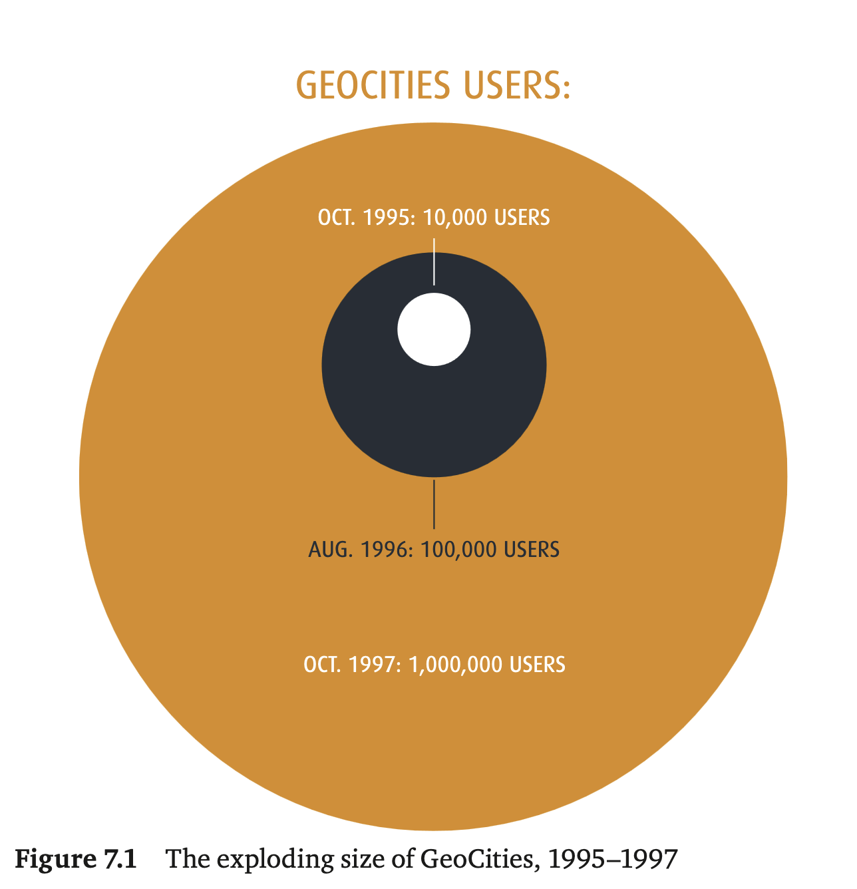

<small> Milligan, Ian. 'Welcome to the web: The online community of GeoCities during the early years of the World Wide Web' in Niels Brügger and Ralph Schroeder (eds.), The Web as History. London, UCL Press, 2017. Pp137-158.  [https://doi.org/10.14324/111.9781911307563](https://doi.org/10.14324/111.9781911307563)
</small>

note:
GeoCities mattered. A powerful publishing platform with potential large audience; enabled the hoi polloi to join the web. This was the era of webmasters and webrings, where a few months cutting teeth at GeoCities could enable you enough familiartiy with HTML that you could spin out a web design business, or buy a domain name and sell a concept to panic'd VC investors who figured anything sprinkled with 'web' magic fairy dust would pay back enormous sums. And why not? A list of links became Yahoo!

- on boarding experience: just needed an email address. You got 1 mb of space. Templates and forms would help you get a website going in five minutes
- accessibility cracked the web open: milligan 'if people were going to visit the web, they needed meaningful content to view; but for creators to want to generate meaningful content, they needed visitors'

---


---


---


---

Key was the neighbourhood system
- [Area 51](https://web.archive.org/web/19961220171417/http://www.geocities.com/Area51/): fans of star trek, x-files, twilight zone
- [Enchanted Forest](https://web.archive.org/web/19961221001802/http://www.geocities.com/EnchantedForest/): kids
- [Athens](https://web.archive.org/web/19961220171426/http://www.geocities.com/Athens/): politics, education

note:
again, the problem that emerges is the organization and structuring of information. Are files and folders the best metaphor, for the web? Superhighway? Tubes? GeoCities went with a very Marshall McLuhan-esque: city metaphor.
- when you joined up you sifted through the neighborhoods to find an affinity area that jived with your interests or your purpose

To enhance the sense of enplacement, Geocities also used web cameras in the real world to tie virtual neighborhoods to real-world locations - Hollywood & Vine in Beverly Hills; Tokyo; Paris; special holiday neighborhoods - 'North Pole' - for seasonal content included a webcam of the christmas tree at GeoCities HQ, adorned with comments emailed in by users

---

Network effects took... effect.... quickly

note:
When onboarding, wizards and templates made it fast to get the necessary bare-bones html working; but if you wanted to learn more, you would be directed to the 'homestead' of another user GeoCities.com/Athens/2090
(that is, homestead 2090 in the Athens neighborhood) called 'The Home Page Home Page' - with basic html guidance and instruction.  User content was folded into the very essence of learning how to *inhabit* geocitites.
-by 1998, these templates and wizards had evolved into a very powerful 'what you see is what you get' site editor, with all kinds of templates for all sorts of purposes - social, food, travel diary, advertising, resume, wedding.

---

## Excavating GeoCities

- the ruins of GeoCities exist as a *torrent* from Internet Archive
- sites can be pulled from it; because of backwards compatibility, a lot of these sites can still work (for a given value of 'work')
- The work of Ian Milligan [see project](https://webarchives.ca/about)

note:
Milligan argues that the ruins - guestbooks, dead links, stopped hit counters, animated gifs, etc - are evidence for strong and meaningful community; he uses DH tools to look at a distance for patterns in how sites were designed or discourses framed

defining 'virtual community' is hard, but people like Howard Rheingold liken it as a kind of gift economy, the gift of attention, with perhaps the hope of help/attention down the road in turn. Milligan: 'Community requires effort'.

- some people argue that geocities was too easy, required not enough effort, to be an actual community; like suburbs where people live alongside each other but do not actually have any shared civic associations;
- milligan agrees that maybe for a lot of the sites on GeoCities that could well have been the case - people sign up, try something out, move on. But for a *non trivial* number, he argues you can see real community in the archive

why does this matter? it matters because this is what the eventual web 2.0 gets built on, and it matters because this is what the enshittification cycle - the eventual poisoning and polluting of the digital environment - requires as grist for its mill. The commercialization of the web early on settled on 'extraction' - strip mining, dragnetting, clearcutting - for its conceits. Geocities embodies that change over.

Incidentally, some folks have trained neural networks on screenshots of geocities homepages as well as homepages for the big companies, and done visual clustering analysis; they find five eras of web design that they suggest correlate to historical developments in the history of the web more generally: that is to say, there's a lot we can explore in the ruins of geocities, not just via textual stuff! visual, sound, accessibility, design, layout...

---

<div align="left">
"...GeoCities sought to be a new kind of web place for its new arrivals: a place where you learned how to make a first website,with the possibility of friendly neighbours and helpful advice, and might even win a few blinking awards to help bolster your confidence. The web might have seemed infinitely big, but that did not mean you could not have a home there." - Milligan
</div>

---

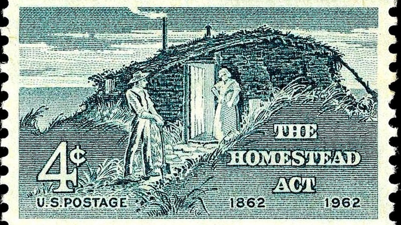

<div aling="left"><small>

homesteading as a metaphor embraces both of those tensions - homesteading creates a community where there was none before *if we accept the doctrine of terra nullius*; homesteading is digital colonialism, and the eventual outcome of that is the strip mine, the clear cut</small>

</div>

note:
in geocities, before yahoo!, you had to decide on a neighbourhood. your address might be geocities.com/athens/ and then the number was the available slot in that neighborhood; there were 9999 slots. After which, a neighborhood might gain a subneighborhood.  Athens for education and the arts; CapitolHill for politics; entrepreneurs in Eureka (notice the recreation of western norms); EnchantedForest for children (with higher regulation and oversight); Heartland for 'families, pets, hometwon values'. Selecting a neighborhood would also give you a sample of existing sites to link to and explore.

You could select a subneighborhood too, at the start, if you wanted; these tended to form around particular interests as well. If after 'moving in' you hadn't really done anything, the system would prompt you, pointing out that in the real world nobody wants to live next door to a vacant lot.

Neighborhoods evolved their own support mechanisms - content moderation through a 'neighborhood watch' that would snark to geocitiesHQ, community leaders, coding standards, web rings, design guidelines.

The system for allocating addresses used icons like military tents for the Pentagon neighborhood, woodsy cottages for EnchantedForest, represented spatially/visually

Remember that 1 mb? The only way to gain *more* space was to buy it, but the only way to gain a second *address* was to continually maintain the neighborhood as an active participants.

The metaphors used by GeoCities, whether consciously or unconsciously, mimicked the US 1862 Homesteading Act. By 1996, 29 neighborhoods.

- when yahoo! takes over and abolishes neighborhoods, they require extensive personal data when you log in, for purpose of targetting advertisements. **You** are now the thing being strip mined, clear cut, commodified.

---

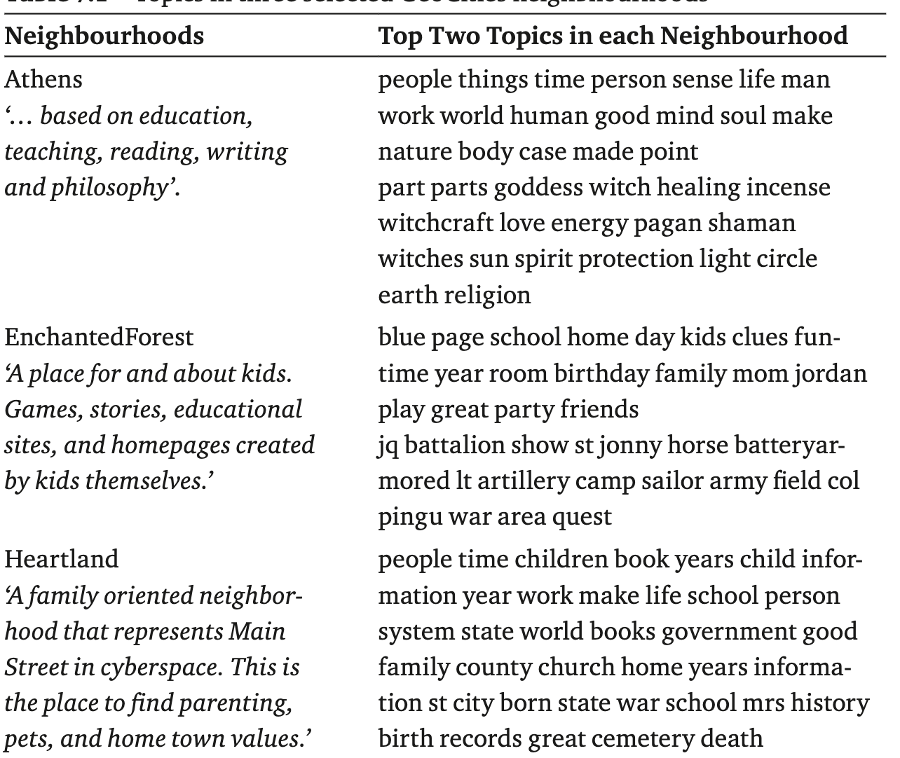

note:
What were these neighborhoods like?

milligan table 7.1

explain topic modeling

---

<div align="left">

## Community Leaders Emerge

"If that's the only reason you want to be a leader, think again. It's hard work. Many of our leaders spend several hours each day answering questions and helping their neighbors set up their sites"

</div>

note:
Community leaders - seems to have emerged from community demand; people could volunteer, HQ would vet; leaders would have some extra powers and exra perks for their own space.

in the BBS era, there was a command (or variations of it) called 'yell for SysOps' that would make the computer hosting the service beeb to grab the admin's attention; this volunteer leader role at geocities is a key evolution away from that towards what we see in the 2.0 web. It will not surprise you that Milligan has found that most of the community leaders were women or femme-identifying (based on text analysis of sites). 

---


note:

Community leaders didn't just police things; they offered help, but they also rewarded good conduct, passing out badges and awards and raising the profile of good citizens. Often the award was an html badge that could be added to the site. You could click on these awards, and be taken to a site discussing the award, showing other winners of it. Many of these awards emerged organically within and across different neighborhoods

guest books were where you could leave a note to the owner of a site; they and guest counters useful for assessing a site's reception; they were included in the defaults for a new site; guest books were also how people created and affirmed each other's identities. 'guest books are a form of role support' (Walker 2000: 106, in Milligan). Guests often left URLs to their own sites, and by doing network analysis on that, you can see that almost half are always internal GeoCities sites, which points strongly to a shared sense of community.

in web2.0, this problem of moderation or community development gets swept under the rug in classic capitalist fashion: make it invisible by employing off-shore workers with poor labour protections and poor pay, and do the bare minimum you can get away with.

so let's talk about the problem of moderation as the web ceases to be an academic project and becomes this new ...*thing*.

---

<!-- .slide: data-background="images/Section31.png"  data-background-opacity="0.4" -->

# Section 230 

What if someone put up something noxious on a website that you were operating the server for?

note:

Were you a platform? Or were you a *publisher?*

Section 230 of the Communications Decency Act of 1996

---

> "No provider or user of an interactive computer service shall be treated as the publisher or speaker of any information provided by another information content provider." (47 U.S.C. § 230(c)(1)).

note:
this protects a person who builds some kind of internet/web service; however it has often been used as a shield to protect a lot of bad behaviour, and an excuse by platforms to not actually remove/prohibit/moderate actually illegal stuff!

Prior to Section 230
- Prodigy, Compuserve, AOL the big three for getting people online
- emerge out of BBS, could connect to the web, but also 'walled gardens' with their own content
- marketing feature. Prodigy promoted itself as family-friendly, moderated
- 1994 user posts potentially defamatory material about a financial securities firm. Firm sued prodigy in New York state court
- prodigy points to an earlier ruling from 1991 about a similar sort of case brought against compuserve; the ruling there likened compuserve to a bookstore; lots of case law that a bookstore is not liable for content in the books it sells, if they are not aware of it (metaphors matter!)
- 1995, judge finds that argument unpersuasive in prodigy case; found that through moderation it was more like a newspaper, and thus exercised editorial control and so could be sued for defamation.
- perverse result: "the more effort a service made to remove objectionable content, the more likely it was to be liable for content that slipped through the cracks. If these precedents had remained the law of the land, website owners would have had a powerful incentive not to moderate their services at all. If they tried to filter out defamation, hate speech, pornography, or other objectionable content, they would have increased their legal exposure for illegal content they didn't take down." https://arstechnica.com/tech-policy/2020/06/section-230-the-internet-law-politicians-love-to-hate-explained/
- Congressmen Ron Wyden (D) and Chris Cox (R) saw that this was a problem for the growing industry, so came up with a plan where owners of services with user-contributed content would be immune, regardless of whther or not they moderated. They thought that this would encourage companies to voluntarily filter things.
- at the time, telecommunications law was being rewritten to make it a crime to knowingly send porn to someone under 18; Wyden & Cox's plan would promote freedom of speech AND remove the prodigy precendent promoting non filtering at all (which would please the anti-porn folks)
- Congress just throws all the stuff together into one law; supreme court finds the anti porn stuff unconstitutional and throws it out, but leaves the section 230 stuff.

---

<div align="left">

So section 230 applies regardless of how much content moderation gets done, but lots of people treat it as if it does

</div>

note:
There is no requirement for 'neutrality' of the kind promoted by eg Elon Musk

But it is too broad imho. As Lee writes, "A bookstore could still be liable if there was proof it knew it was publishing an obscene or defamatory book. By contrast, Internet providers are immune even if they know about illegal content on their sites and leave it online"

Courts elsewhere hold platforms responsible, but with american dominance of the internet... facebook etc just keep putting shit online and taking no responsbility, deleting all evidence of crimes if their attention is drawn to it.

section 230 permits things like FB, etc. I helped found a group that argues 230 needs reform "if it's illegal everywhere else it should be illegal online". Some have proposed adding a rider to it"...for platforms that take reseasonable steps to prevent or address unlawful uses of its services'

---

So let's take a look at the [first website and what was out there](https://info.cern.ch/hypertext/WWW/TheProject.html)

note: 
take a path 'what's out there?' -> by subject -> by electronic journals. What are we looking at? We're looking at an email post from a listserv! which points to gopher pages!

go back and look at 'by type' and notice the variety of things that are on the internet but are not the web.

---

## The Web Under Attack

...sometimes, quite literally, requiring efforts like: [SUCHO](https://www.sucho.org/)

---

...sometimes, quite politically:

- [Department of Justice, US](https://www.yahoo.com/news/articles/doj-deletes-own-study-website-032537612.html)
- [US deleting climate data](https://www.bbc.com/future/article/20250422-usa-scientists-race-to-save-climate-data-before-its-deleted-by-the-trump-administration)
- [The Enola Gay](https://www.forbes.com/sites/conormurray/2025/03/07/enola-gay-aircraft-and-other-historic-items-inaccurately-targeted-under-pentagons-anti-dei-purge/)

---

...and not just in the US, eg:

- [Turkey](https://www.msn.com/en-in/news/world/erdogan-s-biggest-rival-jailed-and-now-turkey-s-internet-is-under-lockdown/ar-AA1BfLjC)

- [Nepal](https://www.cbc.ca/news/world/nepal-new-prime-minister-deadly-protests-1.7633525)

---

Age barriers & unintended consequences [as in the uk](https://www.theguardian.com/technology/2025/jul/24/what-are-the-new-uk-online-safety-rules-and-how-will-they-be-enforced)

note:

re these verifications: you have to upload to a 3rd party your ID! Data breech, enshittification, further marginalizing of people already marginalized, only biggest companies can afford to comply, others now breaking the law... it can also be defeated with the picture from an anime, or forces people into even more dodgy corners of the web...

Net neutrality under attack: the idea that all traffic is carried, regardless of who sends or who receives, through analogy to telephone networks. 1996, Clinton amends 1934 communications act, and the metaphor was that the net is a kind of utility; but this interpretation undermined by ruilings in 2025 that argue otherwise. See also FCC which is meant to regulate things but is more happy to police speech it doesn't like. 

---

<div align="left">


### The Web =/= The Internet

+ but it emerges from and is integral to the continuing development of the internet
+ what did the internet look like _without_ the web?
+ what enabled computers to talk to one another in the first place?
+ what were the scientific underpinnings? what were the first 'imaginings' of how to render those insights in physical form (ie, prototyping)? What are the intervening social necessities that determine if a prototype succeeds or fail? And finally, how does something enter the market as 'an invention'?

</div>

note:

these last ideas about social necessities etc are another framework for understanding technological innovation that we will use frequently in the next part of the course. 'Theory' isn't something that is just made up; rather it is a systematic ordering of ideas that together explain some phenomenon. The phenomenon we're after is, why did some technologies and not others win out?