
<small>

[https://archeologie.culture.gouv.fr/lascaux/fr/visiter-grotte-lascaux](https://archeologie.culture.gouv.fr/lascaux/fr/visiter-grotte-lascaux)

[Amateur Archaeologist Uncovers Ice Age Writing System](https://www.theguardian.com/science/2023/jan/05/amateur-archaeologist-uncovers-ice-age-writing-system)
</small>

note:
Imagine.... it was cool out... you descend into these caves. by the guttering lamp light, the images dance and flicker and seem to come alive. What might these images mean? What do the dots convey? What is *the message?*

per the guardian: 'Cave paintings of species such as reindeer, fish and now extinct cattle called aurochs and bison have been found across [Europe](https://www.theguardian.com/world/europe-news). Alongside these images, sequences of dots and other marks have been found in more than 600 ice age images on cave walls and portable objects across Europe....By using the birth cycles of equivalent animals today as a reference point, the team deduced that the number of marks associated with ice age animals were a record, by lunar month, of when they were mating. They believe the inclusion of a “Y” sign, formed by adding a diverging line to another, meant “giving birth”.

a protowriting system (cuneiform emerges 3400 bc in sumer). writing on stone, writing with pastes mixed up from bodily fluids, ground up mineral pastes, charcoal from the fire: these messages were meant to last, meant to be understood; and they said, 'we are here and this is ours'.

---

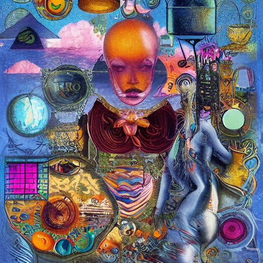

The Medium is the Message

note:
sometimes the fact of the medium is often more important than the message itself. the way we extend our minds into new technologies has an impact on how we use old technologies; he called this 'amputation'- we extend our minds, our abilities with cars, we tie off or allow to wither the way we used to build cities with walking in mind. consequently, our health suffers, and we end up with cities where we couldn't really walk even if we wanted to. Such is barrhaven. He also argues that when we over extend, when the negative effects of the new technology become too much, we lose the benefits of the new technology.

---

'Medium' is something that carries something else.

Let's think about that relationship, that *carrying.* 

---

- And media come in different *classes* or kinds of things

- Who decides that something is *important* ? 

- Whoever makes that decision gains importance/power themselves!

note:
Classification and the catalogue as a control of knowledge dissemination (Foucault). he argues that when classifications shift, there's been a shift in power or focus too. he also points out that classification puts some things out-of-bound, all the better to control them.  He explores how these classifications get made manifest in architecture, for instance, and how they create new objects for study.

---

'[...] classifications both reflect and direct our thinking. 

The way we order represents the way we think' 

- Stephen Jay Gould, 'The Titular Bishop of Titiopolis', *Natural History* 90: 22 1981

---

We're going to think about these things in the context of a whirl-wind tour of humans-making-scratches-on-things; we'll start with stone and finish with magnetic impulses.

---

note:
So let's go waaaaaaaay back. We are, as far as we know, the only animals to make information-rich markings on durable materials. These *media* or 'intervening substance through which something else is transmitted or carried on' extend human cognition, don't they?

The clay tablet *remembers* for us. The clay tablet carries words forward into the future.

---

<table cellspacing="0" cellpadding="0">
    <tr>
      <td>
        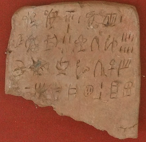
      </td>
      <td>
        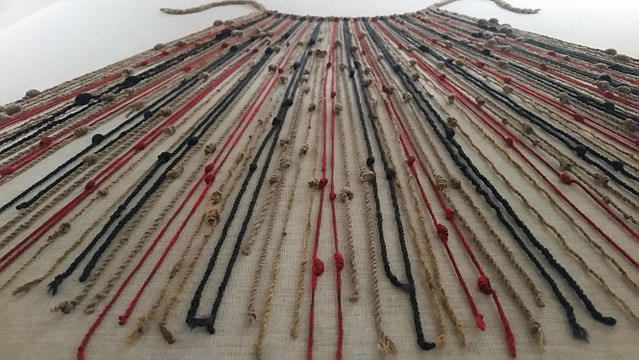
      </td>
    </tr>
    <tr>
      <td valign="top">
        
      </td>
      <td valign="top">
        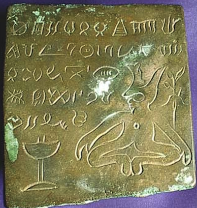

      </td>
    </tr>
 </table>

note:
writing emerges several times, independently in human history - cuneiform in Mesopotamia, different 'linear' scripts in Crete (2 millenium BC), hieroglyphics in Egypt, glyph systems in the Indus valley, the rongorongo of Rapanui (Easter Island); varies glyphs and physical systems (knots / quipu, wampum) in Central and South America; character-based symbols in China; notation systems for counting date even earlier 

a society can be illiterate even if it also has a writing system

The evolution of writing systems seems to emerge out of the need to count - whether what is counted is heads of sheep, baskets of grain, lunar cycles and the pregnancy of animals, or the motion of stars in the sky (calendars). 

---

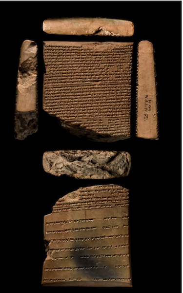

[link](https://www.britishmuseum.org/collection/object/W_K-66)

note:
How did these ancient people store and transmit information?

- clay tablets
- papyrus
- stone ('epigraphic habit' of the romans)
- wax tablets
- engraved in metal, bronze, lead

---

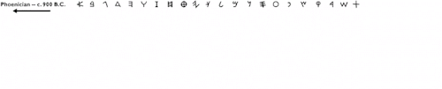

(this gif is *everywhere* on the internet. It's more or less correct; I wish I could find the original)

note:
+ correlations with sound did not exist at first. our western alphabet evolves out of several factors in near eastern systems - ox, aleph, alpha, A; speakers of semetic languages did the work that first mapped the symbols to the sounds of the spoken language; early writing did not in fact 'speak', as it were.
- Greeks had a tradition that they received the alphabet from the phoenicians (8th century and later; phoenician script stabilized around 1000); the phoenicians also were active in italy; etruscan scripts show both phoenician and greek influence; the roman alphabet comes from the etruscan
- read johanna drucker's book Inventing the Alphabet: The Origins of Letters from Antiquity to the Present if you want more of this sort of thing

---

# 𒈠𒌷𒆠

note:
libraries emerged before alphabetic scripts; Mari - settlement founded at start of 3rd millenium to control access to headwaters of euphrates (closest point towards M. sea); archive of more than 3000 letters from 1800-1750 (start of 2nd millenium)

the medium was quite literally the message - that is, the ability to own, control, and have these things created power, status, prestige. it was control of a societies extended cognition

Writing systems seem to be associated at first with places of ritual and communal gathering. This is not the same thing as saying palaces and temples; the latter implies a centralized control and political organization that emerges after writing systems. Temples might have emerged as places that *taught* writing...  the need to train scribes and specialized 'readers' he need to train scribes had social/economic and also: biophysical implications (grain, domestication, support of workers not employed in subsistence)

-scribal culture in these bronze age cultures (roughly, 2nd millenium bc); to read was more like, to be read to, a culture of listening, a culture of performance

---

...we'll now jump forward, oh, about 2 millenia...

König, Jason, Katerina Oikonomopoulou, and Greg Woolf. Ancient Libraries. New York: Cambridge University Press, 2013.  https://doi.org/10.1017/CBO9780511998386.

note:
libraries- rooms of scrolls in little pigeon holes; in the Roman world, the language to describe libraries is part of the same discourse that describes other places and activities of refined leisure. a bibliothecae was a room to display one kind of treasure, a pinacothecae another; a library is a place of collection, of selection, of curation; an archives is a workaday room, very similar, that contains legal records; both have an end user in mind of a very particular kind.

ordering by author, or ordering by genre (tragedies, comedies, natural history, philsophical themes, or ordering by purpose)

---

plot thus far

note:
+ the medium for a message is as important as the message (both for its affordances or what it permits to write, but also for how it extends our abilities to think/see the world in new ways)
+ how we classify media/messages has implications for power, control, and discipline (reflects and directs our thinking)
+ writing/counting intimately connected
+ the infrastructure for writing spills out, has impacts on society
+ libraries reflect the world back to itself (for why else would extremists attack library readings & book lists?)
+ there is no 'natural' way to organize materials in a library

---

Let's jump oh another 1000 years, say.

How about that moveable type, eh?

Korean movable type from 1377 used for the _[Jikji](https://en.wikipedia.org/wiki/Jikji "Jikji")_
+ Go check out the [book arts lab!](https://library.carleton.ca/building/book-arts-lab)

note:
- Gutenberg does not invent
- technology is invented in China, around 1000; earliest surviving books printed with moveable type come from Korea, 14th century at least
- https://artsandculture.google.com/story/movable-metal-type-great-invention-of-korea/vwWBbBU3V1g21Q
- so why do we care about gutenberg? there are many fewer characters in the roman writing system; the statistical properties of european languages (lots of 'e's, many fewer 'q's) meant that one could set text quickly, resuse materials quickly, using a matrix to hold the things
- sign up for the book lab to experience more of this for yourself

---

note:
In a way, moveable type enables both the reduction in uncertainty around letter forms in european languages - enabling faster reading/communication - and faster reproduction. The ability of people to read the bible in their own language, free from 'expert' intervention, is amongst other things the spark that lights reconfiguration of european society
- reduction in 'acceptable' letter hands.
- perhaps a reduction in the sensual interaction (illuminated manuscripts, ink blotches, cat paw prints, the smell & texture of vellum, etc)
- few manuscripts, dissemination of contents safe, controlled
- books, dissemination wild, uncontrolled; anyone can be an author, anyone can be a reader
- libraries still status symbols; emergence of more universities, more books
- many different classification schemes emerge

---

### I'm skipping a lot of history here, eh?

But let's talk about Melvil Dewey (1851-1931)

note:
Dewey takes his starting point from Francis Bacon, who argued all knowledge comes from memory, reson, or imagination, thus books could be classified as either being history, philosophy or 'belles lettres', stories
- he worked in the amherst college library, and wanted the library to be used for educating folks beyond the library. he studied other libraries - finding that there was no real systemization of the catalogue (dogs under 'dogs', 'horses' under 'horses', neither under 'animals', eg), or alphabettically according to author
- encounters the idea of using decimals as classifiers, since a decimal number is infinite
- he orders knowledge philosophy (contains everything else) theology, government, philology, natuer (math, phs, chem, etc) useful and fine arts, finally geography, biography, history.
- but all this was filtered through his experiences and what he was taught at Amherst

---

So what?

note:
- dewey's system hits the US at a period when publice benefactors are building, expanding and reorganizing public libraries;
- the other major system is the library of congress cataloguing system, designed at roughly the same time. The LLC is different from dewey in that it focuses on what is actually in the collection, rather tha proscribing how knowledge should be organized. Dewey turns up often in public libraries, LLC in research ones; universities are expanding at this time too. LLC reflects the biases of Congress' interests (& the fact that the library was started with the gift of Jefferson's personal library & his interests) - american, european, christian bias.
- These are the two systems that would've seemed a natural way to organize knowledge to the same people who start working on what it means to compute 'information' 

---

<!-- .slide: data-background="http://www.johncoulthart.com/feuilleton/wp-content/uploads/2013/02/library3-big.jpg"  data-background-opacity="0.45" -->

"The study of invisible writings was a new discipline made available by the discovery of the bi-directional nature of Library-Space. The thaumic mathematics are complex, but boil down to the fact that all books, everywhere, affect all other books. This is obvious: books inspire other books written in the future, and cite books written in the past" - Pratchett

note:
- it's also worth pointing out being shelved nearby implies some sort of connection between the ideas in the book

---

Vannevar Bush's [Memex introduces a completely new idea](https://web.mit.edu/STS.035/www/PDFs/think.pdf): 

"associative indexing... whereby any item may be caused at will to select immediately and automatically another... [so that] numerous items have been thus joined together to form a trail" - V Bush

We can call this the 'bidirectional link'

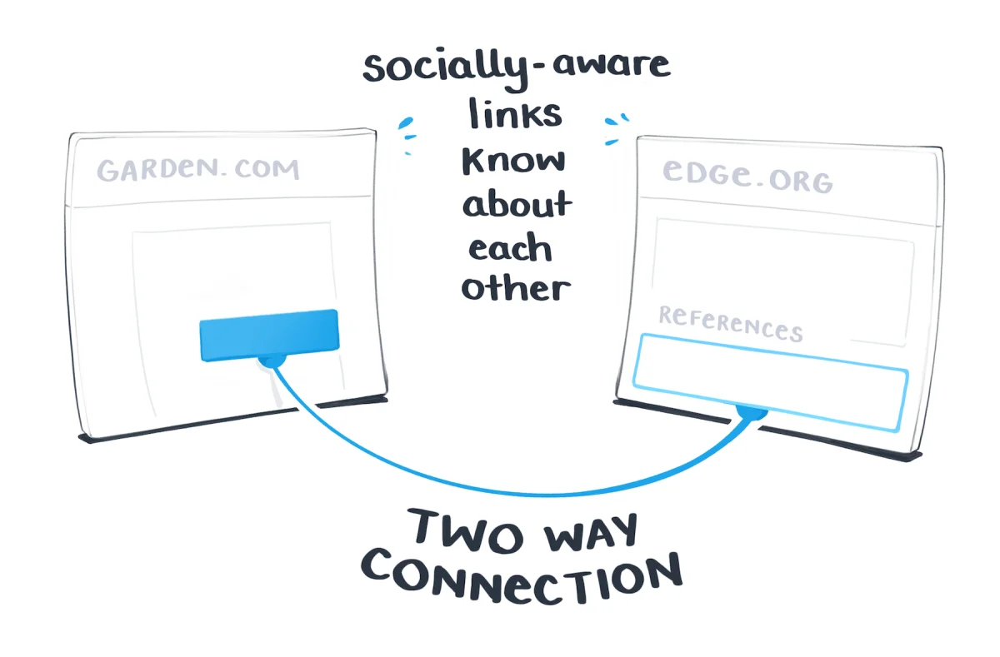

(Maggie Appleton)

---

1965: Hypertext!

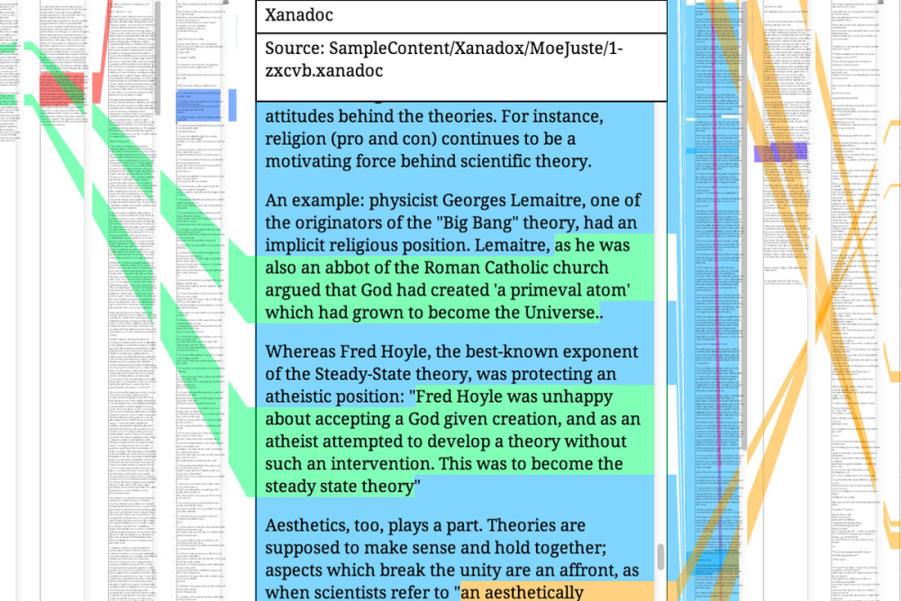

...more on this in a moment...

note:

In **1965** Ted Nelson coins the word *hypertext* to capture what a computer might do to the books it knows, or the things we might *write* with a computer (nb writing documents not one of the main things people wanted to use computers for back then)

this was not successful, but it did give designers and computer scientists something to shoot for, a document aware of what it was built from, and what it inspired in turn. A living assemblage.

---

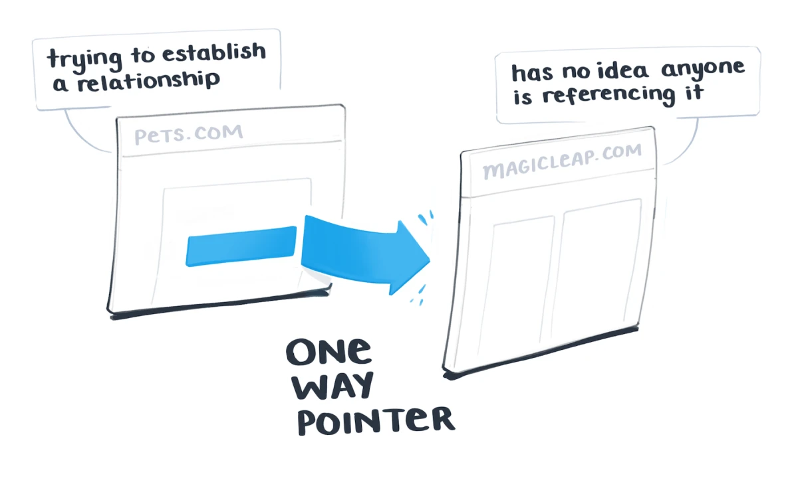

This is what hypertext became.

note:
What if our library catalogue had this sort of thing? What if the web, what if the internet, had allowed this?

---

Plot so far *continued*

note:
- no natural way for documents/information to be organized;
- people *tried* to find a 'natural' way to organize information
	- these categorizations ended up reifying the way they already believed the world to work

---

- in a north american context, the two big approaches (Dewey, Library of Congress) hit at the same time there is massive public investment and expansion and reform of education (even the blackboard was a new idea once!)

- proximity on shelves also enables a kind of *discoverability*; 'serendipity' it's sometimes called: but a function of a particular vision of the world, a reproduction of its norms

note:
incidentally, this is why getting the library of congress to capitulate on something seemingly as silly as 'the gulf of america' matters

IMPORTANT-
- invention of the digital computer happens not all that long after these massive reorganizations
- the digitization of knowledge is built by people for whom these categorizations/classifications of the world are normalized

---

## a new kind of document inspires new ideas from new affordances

note:

But the creation of a new class of document - the electronic document - on a new medium - the computer - inspires new ideas:

+ People like Vannevar Bush are already thinking about what a digital computer might do to *knowledge work* (which isn't what computers were invented for!)
- Peple like Ted Nelson is inspired by the Memex to invent the term hypertext to capture the idea that maybe documents might have a kind of 'awareness' of each other

---

So, to sum it all up:

- the physicality of messages/books has impacts in the world
- this physicality has changed over time/ thus impacts in the world have changed
- when new classifications shift, there's a shift in power too
	- every phase of the 'internet' that we shall see involves this shift

---

## But... text Interfaces Kinda Suck

note:
In the late 80s, computers & the internet were all text based, and mostly menu or command line driven.

Apple has some better answers, based on ideas stolen from hypertext but they're not as popular as other systems, in the 1980s. Way too expensive.

---

<small>
"HyperText is a way to link and access information of various kinds as a web of nodes in which the user can browse at will. It provides a single user-interface to large classes of information (reports, notes, data-bases, computer documentation and on-line help). We propose a simple scheme incorporating servers already available at CERN... A program which provides access to the hypertext world we call a browser... " Tim Berners-Lee , R. Cailliau. 12 November 1990, CERN
</small>

note:

reminder,
- '92 CERN waves rights to web protocols, royalties
- 1993: Mosaic Browser is released & CERN open sources web protocols; for all intents and purposes the web is born
- '94 Mark Andreessen takes Mosaic browser from NCSA and commercializes as Netscape
- 1994/1995 companies that formerly offered access through dial-up to BBS systems (CompuServe, AOL, Prodigy) provide access to the larger internet
- (2025 AOL finally kills the last dial-up access to the internet)

---

### Hypertext was so cutting edge, it had its own conferences

December 1991 - Hypertext '91, San Antonio, Texas

note:
- Tim Berners-Lee's paper is rejected, but he gets into the demo session
- Main difference to most hypertext systems: pages could be distributed on _different_ computers but links were one way
- Tim Berners Lee - his vision of hypertext features one-way links only; the document _itself_ would be the atomic unit of thought, hence urls point to *pages* (while most hypertext systems could take words, images, paragraphs, phrases, concepts as individual atoms of thought)

Since links are not bidirectional, link rot and decay is inevitable 

---

note:

Hypertext attendees not impressed. Berners Lee mostly ignored. By hypertext '93 more than half the demos were web based; by hypertext '94 Berners Lee gives the keynote address.

His impoverished vision worked because it grafted well on what had gone before _amongst the audience most primed for it_: the people who used BBS text services.

---

<!-- .slide: data-background="images/xanadu_au17yq_shrink_tqkdxs.jpg" data-background-opacity="0.25" -->

### OK, so what WAS hypertext before the web's impoverished version?

Ted Nelson, Xanadu
- coins the word 'hypertext'
- never built
- demo [here](https://xanadu.com/xanademos/MoeJusteOrigins.html) | [Long read in Wired, 1995](https://www.wired.com/1995/06/xanadu/)

note:
Hypertext was a scholarly pursuit. But it gave Berners Lee the rudiments for pulling what was already familiar out of text and into graphical wide-spread use.

---

#### Xanadu is best remembered as a 'pattern language'

A *pattern language*, per [Maggie Appleton](https://maggieappleton.com/xanadu-patterns) helps us approach questions like:

<ul><small>
<li class="fragment"> How do we structure information and build relationships between pieces of data that help us see them across contexts, and clarify understanding?</li>
<li class="fragment">How do we build systems that allow people to collaborate on shared documents without losing authorship?</li>
<li class="fragment">How do we bring ideas and data from a variety of sources into conversation with our own, while leaving a clear trail back to the origin?</li></small>
</ul>

---

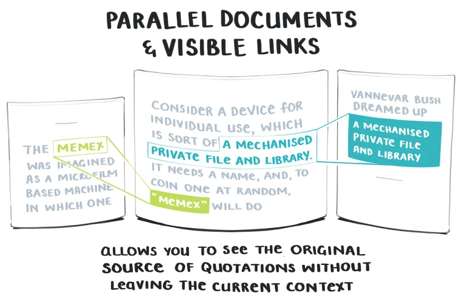

Xanadu patterns:
<ul><small>
<li class="fragment">jump links versus visible links (visible better!)</li>
<li class="fragment">parallel documents</li>
<li class="fragment">transclusion</li>
<li class="fragment">stable addresses for <b>blocks</b> of text</li>
<li class="fragment">annotation overlays</li>
<li class="fragment">multiple views</li>
<li class="fragment">micropayments</li></small>
</ul>

---

Nelson: "HTML is precisely what we were trying to PREVENT— ever-breaking links, links going outward only, quotes you can't follow to their origins, no version management, no rights management."

---

"What we're now seeing is the ad-hoc, decentralised manifestation of Xanadu in bits and pieces.

People are building Xanadu without knowing what Xanadu is.  

Which is the essence of a good pattern language; true patterns evolve naturally within systems, and are found rather than crafted." - Maggie Appleton

## \<cough\> \<cough\> Research Précis & Memo!

---

### A quick genealogy of hypertext systems & researchers

You can read the [ur-text of hypertext, Vannevar Bush's 'As We May Think' here](https://cdn.theatlantic.com/media/archives/1945/07/176-1/132407932.pdf)

note:

THERE WERE MANY HYPERTEXT SYSTEMS DEVELOPED. THIS IS JUST A SAMPLE

---

Hypercard etc.

 

---

note:

- Xerox - Cathy Marshall, works on NoteCards, subsequently develops Aquanet and Viki - 1984
- Marshall comes up with a system that imagines information on notecards with hypertextual linking, where cards could be chained together into sequences, or mind maps, or collections; part writing tool, part information browser. Marshall called it an 'idea browser'. They actually designed it for use in Intelligence analysis (so that the premises on which policy was built could be examined.) Intelligence services never use it. Used throughout PARC though

- a very similar product becomes bundled with Apple in 1987, 'HyperCard', 1987
- my first exposure to digital archaeology was a hyper-text rendering of an archaeological excavation archive of a dig on an Iroquoian long house dig.

---

The New Domesday Book

- 1986 BBC produces a new Domesday Book - on laser disc using hypertext principles
- interactive explorations, with links & a pointer

note:
this would've been one of the first introductions to the idea of 'hypermedia' 
- The Domesday Discs had crowdsourced memories and stories, pictures and video - tremendous multimedia
- Project was part of the inspiration for the work of Wendy Hall, computer scientist - at Southampton, CS dept not interested in her work on multimedia; moves to U Michigan discovers this is called 'hypermedia
- eventually returns to Southampton in time for the donation of Mountbatten's papers (war hero, assinated in 1979 by IRA)
- archive had film, photo, sound, no linear sequence of material, archivists were despairing how to archive it
- by 1989 they had a hypermedia system running that interwove the materials in the archive - multimedia navigation, database of links that new what was connected, using the metadata about the links to foster new kinds of information. the link wasn't in the document, it was in the linkbase and it overlaid all of the materials. Where the archives mention Ghandi, the linkbase contains the idea of Ghandi, thus one link actually ties to multiple materials. Evans: 'for every name, for every idea, for every linkable thing,  a single repository of supplementary material updated by everyone in the world, filtered based on parameters determined by the user'
- a link could point to multiple places at once, and new links could be generated on the fly. The value was on the associations, not the documents

---

Microcosm

- Wendy Hall, leads development in late '80s of [Microcosm hypermedia system](https://www.youtube.com/watch?v=DF9oAwUgmKo) 
	- (at about the 1.30 mark, links with multiple destinations!, 2.14 - links in moving images); 
- could have been a competitor to TBL's 'web'; was technically superior

note:
- Archive had film, photo, sound, no linear sequence of material. Hypermedia system that interwove materials - multimedia navigation, database of links

---

- Intermedia - a system that connected five different applications into a 'scholar's workstation' 
- by Nicole Yankelovich, Nancy Garrett, Karen Caitlin; 
- Apple nicks elements of the design

note:
Many hypermedia/hypertext systems developed in the 80s, striking preponderance of women involved. 

Key thought: how best to organize information, surface new information?

---

## Even Deeper Inspiration

 

note:
Several *folders* held in here, into which one places *files* (collections of papers, arranged in order)

---

Jorge Luis Borges, Garden Of Forking Paths (spanish, 1941; English, 1948)

"This web of time - the strands of which approach one another, bifurcate, intersect or ignore each other through the centuries - embraces every possibility"

note:
describes a novel where all possible outcomes exist concurrently. Finnegan's Wake. Ulysses. For a bit less highbrow, let's think about choose your own adventure

Any text that refers another is a kind of hyper text

The Talmud is hypertext

An academic article is a hypertext

In hypertext, the text itself has *depth* 

---

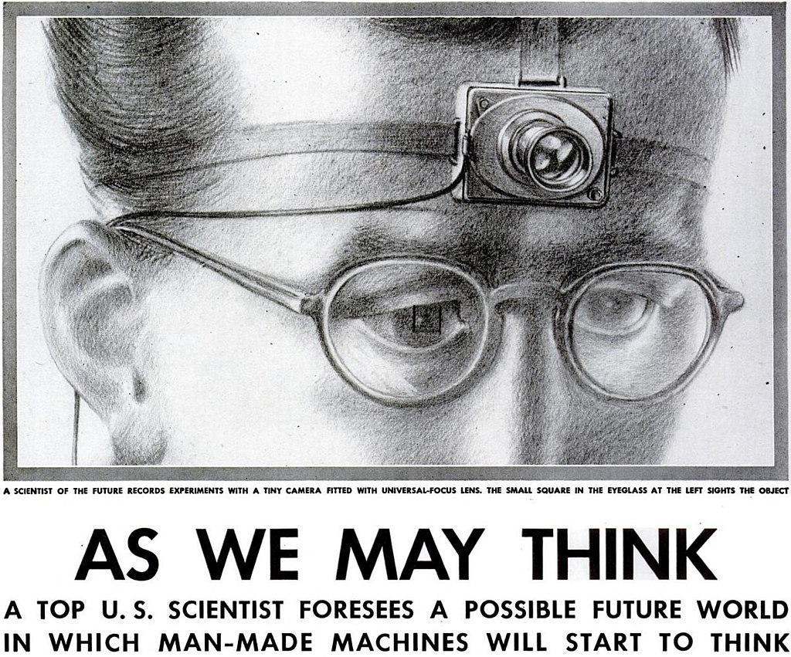

#### In computerized hypertext

- some act of selection enables you to pass to another level or another related concept

- a formalization and action based on a *relationship*

- the relationship itself has some capacity to *act*

---

## What We Lost: Hypermedia vs Web

**Hypermedia:** constructive; to navigate it was to also forge the links that made things meaningful

**Web:** passive; to navigate it is to go where the paths have been made for you.

note:

Clare Evans: "Today, we mostly think of hypertext as being something related to the Web, rather than of the Web as a technically inferior manifestation of hypertext principles"

But just like the early arpanet only became popular through a very minimal use of its capabilities - email - so too does hypertext only become popular through this minimal realization. But it pretty much nukes hypermedia as a research area. By 1994, a lot of the pioneering work done by people like Cathy Marshall is forgotten, ignored, reinvented. Amazing. By 1997, a separate Web Conference has emerged and scheduled at the same time as the hypertext conference.

---

## Conclusion

The web succeeded not because it was the best hypertext system, but because it was good enough for the community that already knew how to be online.

note:

- Tim Berners-Lee's "impoverished vision" won because it built on what came before: the text-based culture of BBS users who were ready for something graphical but familiar.
- Simplicity beats sophistication when it comes to adoption
- Public funding enabled private innovation at every step
- Women-led research in the 1980s pioneered many concepts we're only now rediscovering
- Community matters more than technology - the web succeeded among those ready to use it

---

Today's "innovations" often echo 1980s hypertext research:

- Block-based editors (Notion, Obsidian) → Xanadu's stable addresses
- Bi-directional linking (Roam, Logseq) → Visible connections
- Version control (Git) → Rights & version management
- Collaborative documents → Parallel documents

We're still building Xanadu, piece by piece, without knowing it.

